# cyberWriter

**Markdown that ships.** A native macOS editor for writers, researchers, and engineers - turns Markdown into publication-ready PDFs, Word docs, and HTML with zero external dependencies. Built in Swift and SwiftUI.

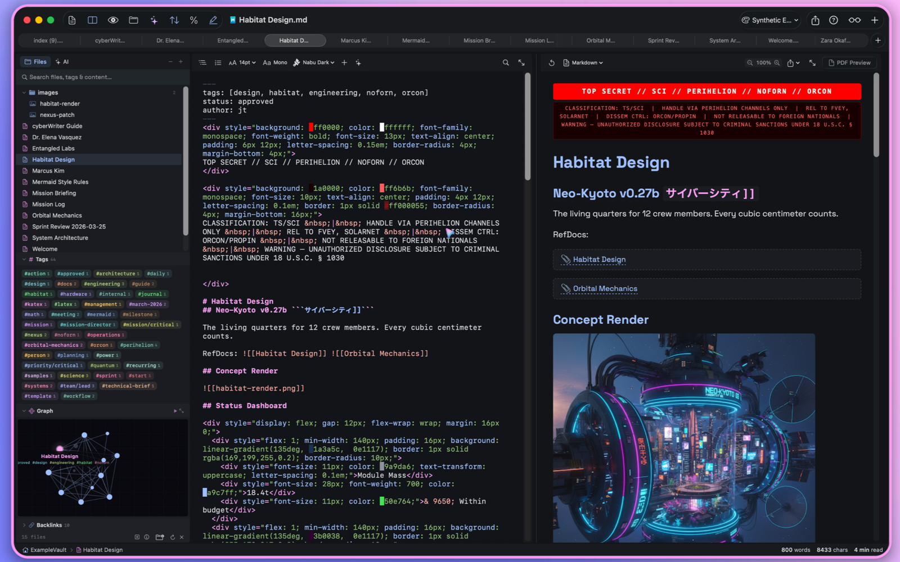

## Download

- **[Mac App Store](https://apps.apple.com/us/app/cyberwriter/id6758079118?mt=12)** - automatic updates via the App Store
- **[Direct Download](https://github.com/uncSoft/cyberwriter-app/releases/latest)** - same app, Sparkle auto-updates, license key from [uncsoft.lemonsqueezy.com](https://uncsoft.lemonsqueezy.com/)
- **[The Architect's Toolkit Bundle](https://apps.apple.com/us/app-bundle/the-architects-toolkit/id1874965091?mt=12)** - cyberWriter + devPad + Anubis Pro

**7-day free trial** - no account required. Both editions are the same app; they only differ in where they get updates.

> Requires macOS 15.0 (Sequoia) or later. Apple Silicon and Intel.

---

## AI Workspace

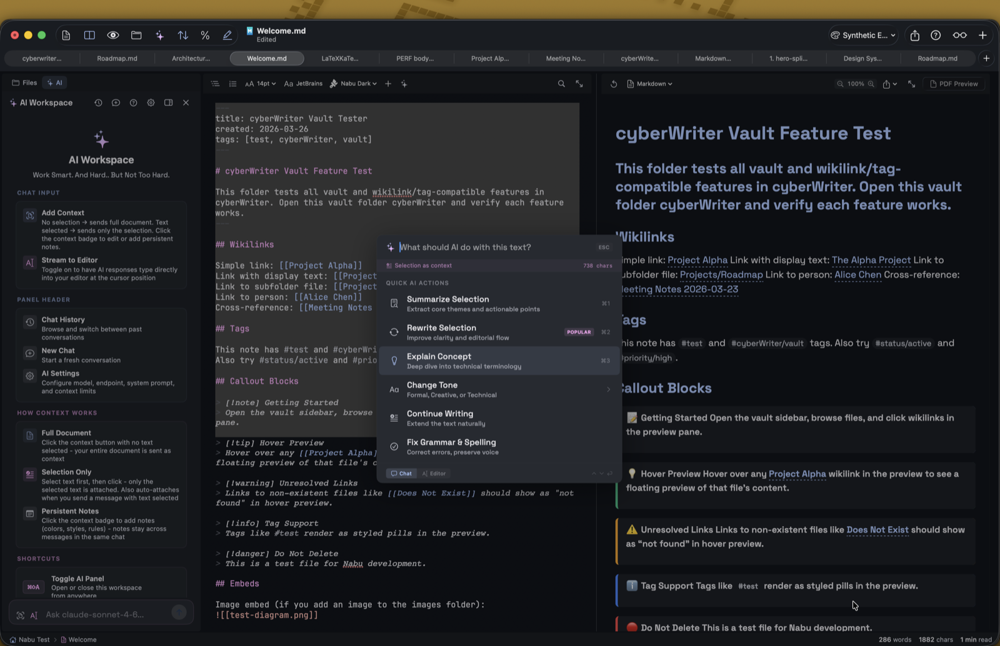

cyberWriter's AI is built around your vault, not a generic chat box.

- **Apple Intelligence** on macOS 26+ - zero-config, on-device, no API keys
- **Chat with your vault** - ask questions across all your notes, get answers grounded in what you've written
- **Vault structure awareness** - the model understands folder layout, wikilinks, and tags, not just raw text
- **Document Map embeddings (RAG)** - every note is semantically indexed, so concept-level search works even when keywords don't match
- **Search for concepts** - find "the meeting where we talked about pricing" without remembering the filename
- **Quick Actions** (`⌘J`): summarize, rewrite, explain, change tone, fix grammar, continue
- **Provider auto-discovery** - Ollama, LM Studio, MLX, vLLM, Claude, OpenRouter, OpenAI-compatible
- **Stream-to-editor** - watch the AI type live into your document
- **File context** - attach `.md`, `.txt`, `.csv`, `.json`, `.pdf` to any prompt

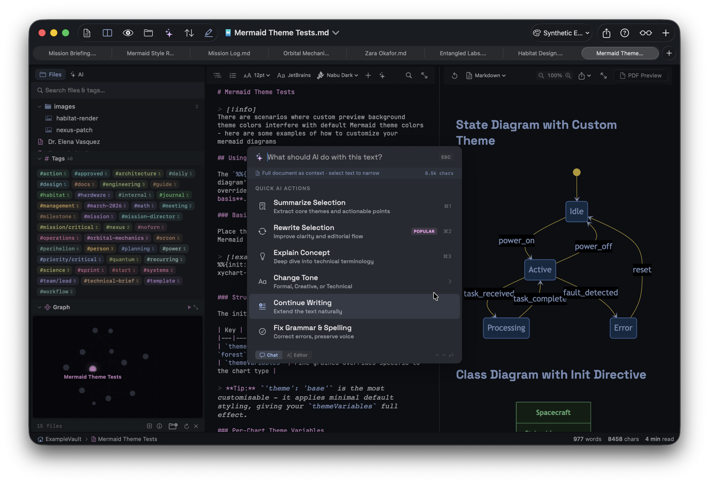

---

## File Vault (Obsidian-compatible)

- `[[wikilinks]]` with hover preview and full backlinks panel
- `![[image.png]]` and `![[recording.m4a]]` embeds
- `#tags` rendered as styled pills, extracted from body and YAML frontmatter
- 12+ callout block types (note, tip, warning, danger, info, success, …)
- Quick switcher and drag-and-drop wikilink insertion
- Reads any existing Obsidian vault - no migration required
 

### Knowledge Graph

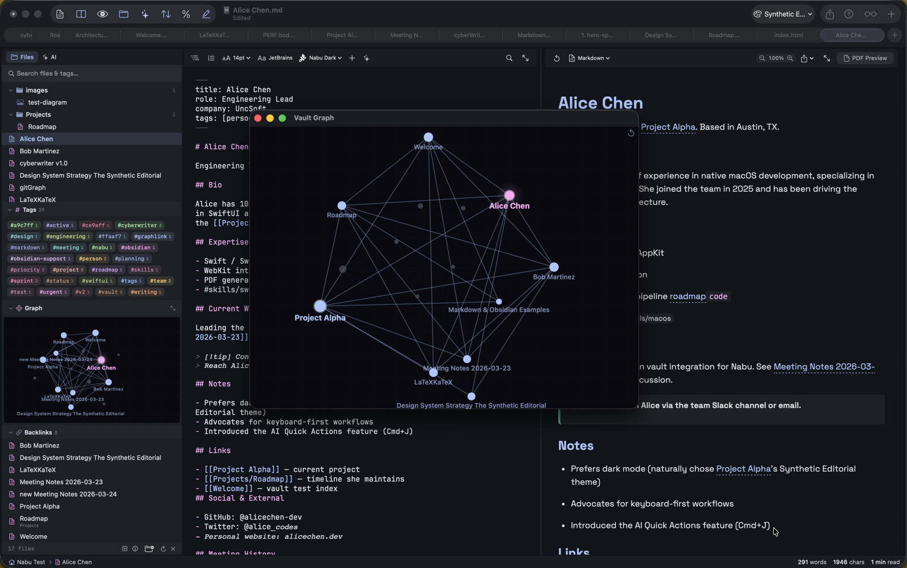

3D force-directed graph of vault wikilinks with hover-to-explore, click-to-navigate, and a tour mode in a floating window.

---

## Rendering Engine

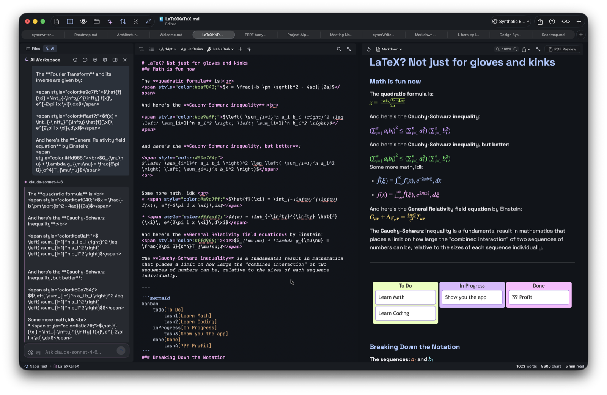

- **KaTeX** math, inline `$...$` and display `$$...$$`
- **Mermaid** - 16 diagram types, dark mode theming, YAML config
- Inline HTML/CSS, footnotes, YAML frontmatter
- SVG diagrams in PDF, PNG in DOCX, interactive in HTML

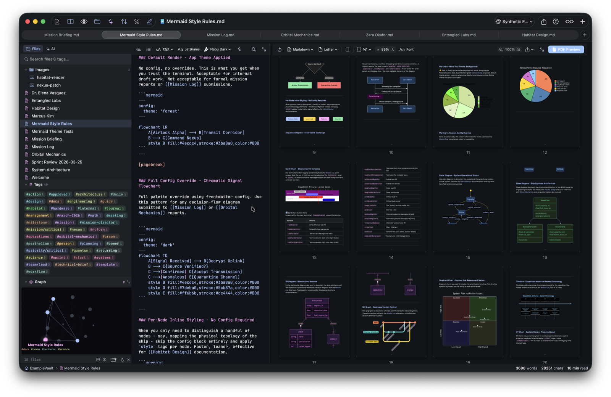

---

## Slides & Flash Cards

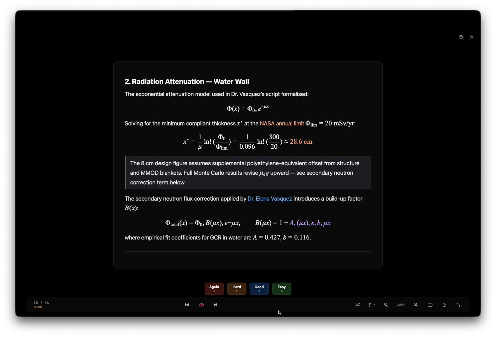

Convert any document into a slideshow or a flashcard deck.

- Split by `---` or headings; `???` separates question from answer
- SM-2 spaced repetition with persistent progress
- Auto-play, shuffle, three layout modes
- Mermaid and KaTeX render on slides
- Auto-generated title slide from YAML frontmatter

---

## Voice & Media

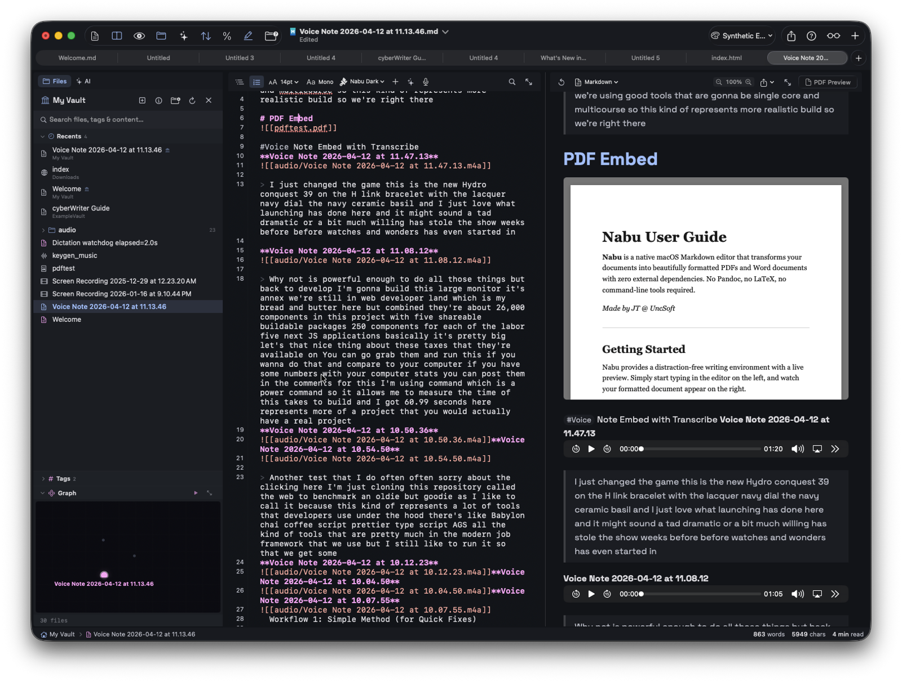

- Voice notes with on-device transcription (SpeechAnalyzer / SFSpeechRecognizer)
- Live dictation mode
- Inline embeds for audio, video, PDFs, CSV, RTF, Markdown, YouTube
- Everything encodes into portable HTML exports

---

## Document Map & Live PDF Preview

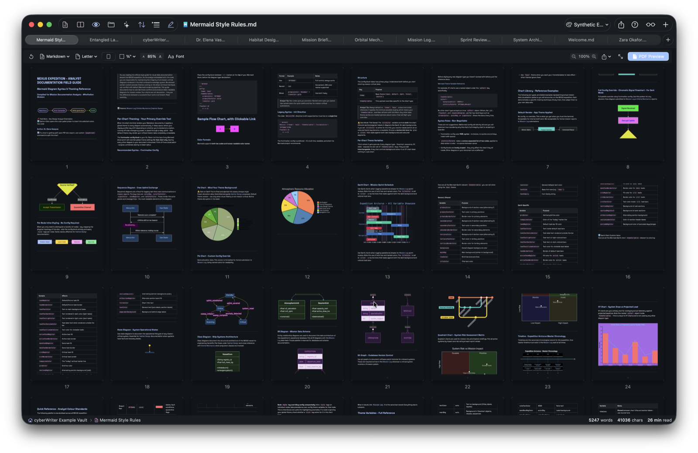

- Zoomable grid of your entire document
- Click any page to jump
- Live PDF preview (`⌘P`) with theme-accurate output
- Page-range PDF export

---

## Editor

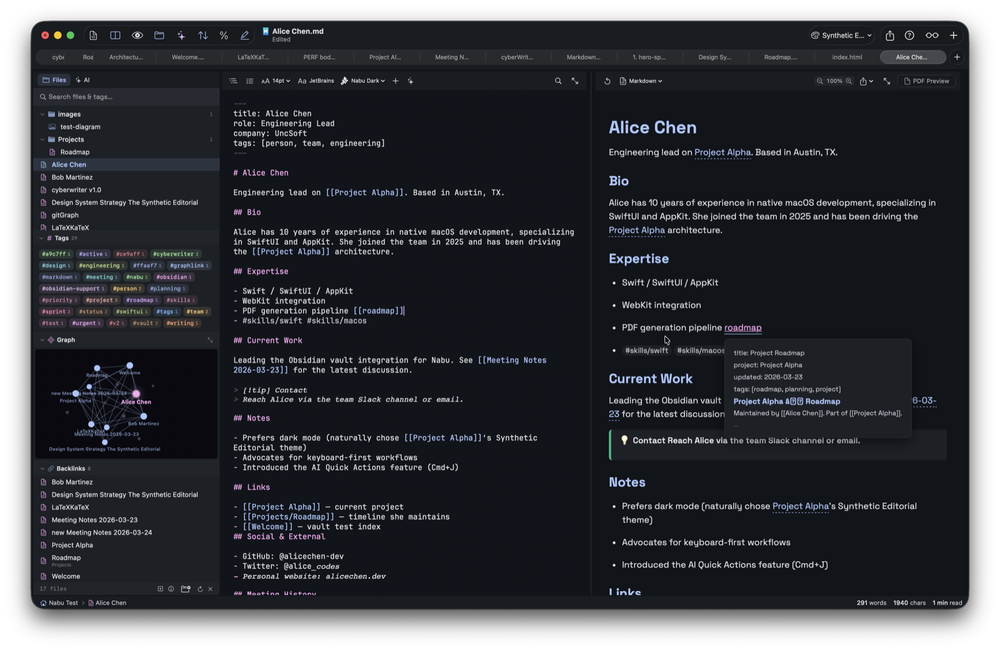

- Three view modes - Editor (`⌘1`), Split (`⌘2`), Preview (`⌘3`)
- 15+ syntax themes, system mode auto-switching
- Outline sidebar (`⌘⇧O`), insert menu, line numbers, scroll sync
- Focus Mode (`⌘⇧F`)
- Slash command palette (`⌘/`)

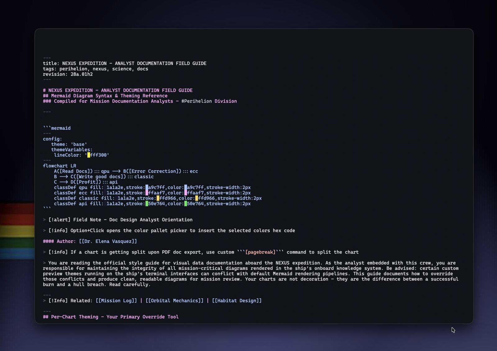

### Color Picker

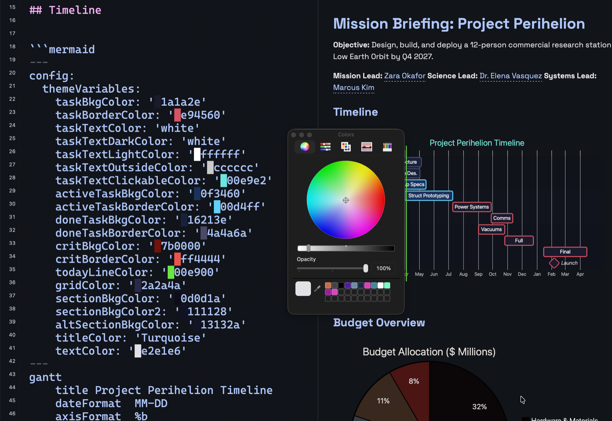

Inline hex swatches in the editor. Option-click any hex to open the system color picker with live updates. Option-click elsewhere to insert a new color. Supports 3, 4, 6, and 8-character hex codes.

### Preview Themes

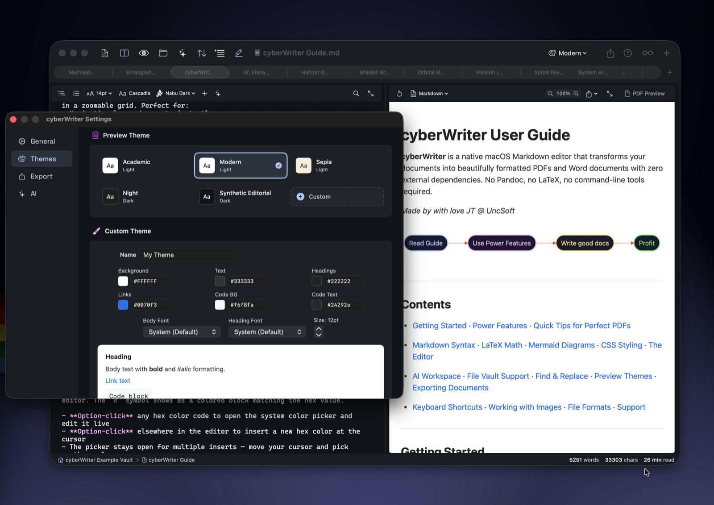

Five built-in themes (Academic, Modern, Sepia, Night, Synthetic Editorial) plus a full custom theme builder. Right-click any theme to duplicate as your own base.

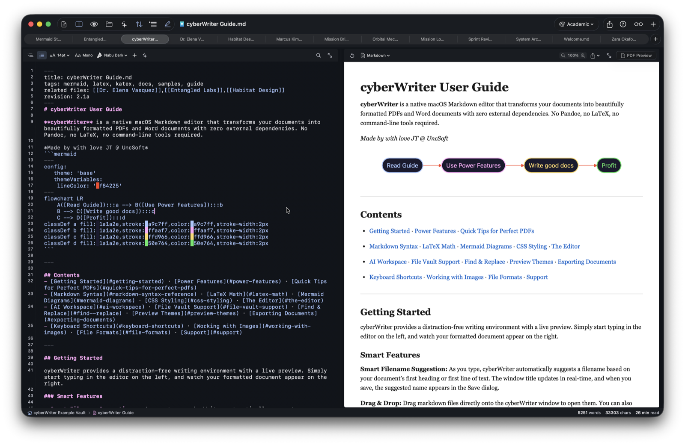

### Find & Replace

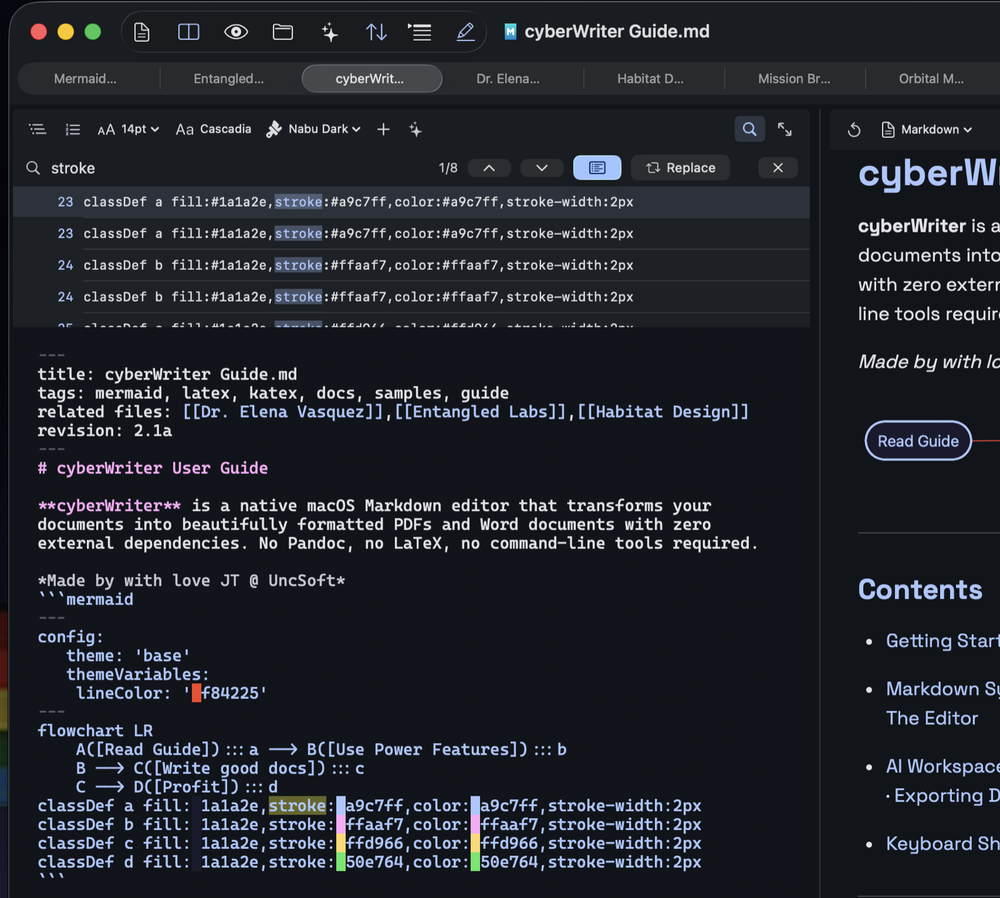

Quick find (`⌘F`) with inline highlighting, plus enhanced find (`⌘⌥F`) with a scrollable results list, line numbers, and context.

---

## Export

- **PDF** - publication-ready, with LaTeX, Mermaid, themed backgrounds, page-range export
- **DOCX** - pure Swift OOXML, no external binaries
- **HTML** - standalone, with embedded styles, media, and PDFs
- **Markdown** - extended, with vault-style links and inline CSS
- **Plain text** and syntax-highlighted code scripts

---

## Example Vault

The [`example-vault/`](./example-vault) folder is the vault that ships with cyberWriter on first launch - open it from inside the app to explore wikilinks, the graph, Mermaid, callouts, voice notes, and flash cards in context.

---

## In the wild

cyberWriter ranks **#7 of 60** note-taking apps by feature powerscore on the [community macOS notes-app comparison sheet](https://docs.google.com/spreadsheets/d/1HtJN4oQ6oBDFmFaF4Qeq5vCGEU1g-KB1DEz5Sp_OwXo/edit?gid=469491148#gid=469491148) - and it's the highest-ranked app in the top tier that **doesn't rely on community plugins** for its core features.

**Why that matters:** every feature here - vault, graph, Mermaid, LaTeX, AI, RAG, embeddings, voice transcription - is built into the app, sandboxed, and reviewed for the Mac App Store. There are no unvetted third-party plugins running with full system access. The direct-sale build is the same binary as the App Store build; the only difference is how it gets updates and how the license is checked.

---

## License & Source

cyberWriter is a commercial product. This repository hosts **public release binaries, the example vault, and documentation** - the source code is private.

- Trial: 7 days, no account required
- License: lifetime, no subscription
- Updates: free, forever
- Buy: [Mac App Store](https://apps.apple.com/us/app/cyberwriter/id6758079118?mt=12) or [direct](https://uncsoft.lemonsqueezy.com/)

Made by [UncSoft](https://cyberwriter.app).
