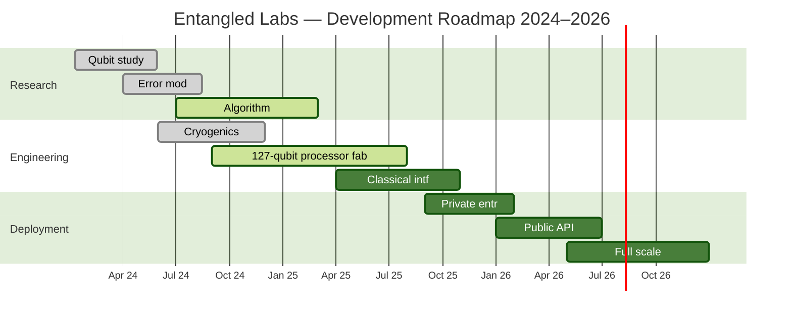
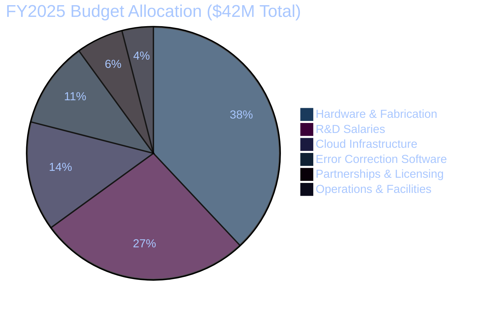

TOP SECRET // SCI // PERIHELION // NOFORN // ORCON

CLASSIFICATION: TS/SCI &nbsp;|&nbsp; HANDLE VIA PERIHELION CHANNELS ONLY &nbsp;|&nbsp; REL TO FVEY, SOLARNET &nbsp;|&nbsp; DISSEM CTRL: ORCON/PROPIN &nbsp;|&nbsp; NOT RELEASABLE TO FOREIGN NATIONALS &nbsp;|&nbsp; WARNING — UNAUTHORIZED DISCLOSURE SUBJECT TO CRIMINAL SANCTIONS UNDER 18 U.S.C. 420 

# Entangled Labs
### Internal Technical Brief — Q2 2025 System Overview

##### Author: [[Marcus Kim]]

###### Related Files:
> [!info] [[Mermaid Style Rules]], [[Mission Log]] 
 

---

  
⚡ System Status Dashboard

  

    

      
Qubits Online

      
127

      
● NOMINAL

    

    

      
Gate Fidelity

      
99.3%

      
▲ +0.2% WoW

    

    

      
System Uptime

      
99.7%

      
30-Day Rolling

    

  

---

[pagebreak]

## 1. Data Pipeline Architecture

The following flowchart describes the **end-to-end signal pipeline** from raw qubit state measurement to external API delivery. Each stage introduces classical overhead; minimising latency at the `Classical Interface` layer is a current engineering priority. See [[Orbital Mechanics]] for scheduled optimisations.

> [!info]
> The error correction stage currently implements a **surface code** with distance *d = 7*, providing a logical error rate below 10⁻⁶ per cycle. Full details are documented in the quantum error correction white paper.

---
[pagebreak]

## 2. Project Timeline

> [!warning]
> The **127-qubit processor fabrication** milestone (`e2`) is currently tracking **3 weeks behind schedule** due to substrate yield issues at our foundry partner. [[Dr. Sarah Chen]] is leading the recovery plan. Impact on downstream deployment phases is under assessment.

---

## 3. Quantum State Formalism

The state of a single qubit on the **Bloch sphere** is represented as:

$$|ψ⟩ = \cos\!\left(\frac{θ}{2}\right)|0⟩ + e^{iφ}\sin\!\left(\frac{θ}{2}\right)|1⟩$$

Where θ ∈ [0, π] is the polar angle, φ ∈ [0, 2π] is the azimuthal phase, and e^{iφ} is the relative phase factor. For a mixed or entangled system, the corresponding **density matrix** formalism is:

$$ρ = \frac{1}{2}(I + \vec{r} \cdot \vec{σ})$$

where r⃗ is the Bloch vector (|r⃗| ≤ 1) and σ⃗ = (σₓ, σᵧ, σᵤ) is the vector of Pauli matrices. A pure state satisfies `tr(ρ²) = 1`; a maximally mixed state yields `tr(ρ²) = 0.5`.[^1]

---

## 4. Architecture Comparison

| Architecture | Qubits (2025) | Gate Fidelity | Coherence Time | Status |
|---|---|---|---|---|
| **Superconducting** | 127–1,000+ | 99.1 – 99.5% | 100 – 500 µs | ✅ Production |
| **Trapped Ion** | 32 – 64 | 99.8 – 99.9% | 10 – 1,000 s | 🔬 Scaling |
| **Photonic** | Variable (boson) | 98.0 – 99.0% | Room temp | 🚧 Pre-commercial |

*Entangled Labs currently operates a **superconducting** platform. Hybrid trapped-ion integration is targeted for 2027 per the hardware roadmap.* #quantum #hardware

---

## 5. Budget Allocation — FY2025

> [!quote]
> *"The coherence wall is not a fundamental barrier — it is an engineering problem, and engineering problems have engineering solutions."*
> — **[[Dr. Sarah Chen]]**, Chief Quantum Architect, Entangled Labs All-Hands, March 2025

---

## 6. Q2 Milestone Tracker

#milestone

- [x] Complete 127-qubit processor characterisation
- [x] Surface code (`d = 5`) logical error rate < 10⁻⁵ demonstrated
- [x] Classical interface latency reduced to **< 2 µs** end-to-end
- [x] Private enterprise onboarding — 3 design partners confirmed
- [ ] Achieve **99.5% gate fidelity** on two-qubit CZ gates
- [ ] Complete cryogenic wiring harness redesign for 256-qubit target
- [ ] Publish quantum error correction white paper (external)
- [ ] Initiate Series B fundraising materials
- [ ] Hire 4× quantum control engineers (open reqs: QCE-07 – QCE-10)

---

## 7. Notes & Known Issues

The current `QuantumKernel v2.3` scheduler exhibits a *non-deterministic latency spike* of approximately **14–22 µs** under heavy parallel job loads. Root cause is believed to be a mutex contention issue in the classical interface layer. A patched build (`v2.3.1-rc2`) is in staging.

**Key personnel:** [[Dr. Sarah Chen]] (Hardware), **M. Okafor** (Software Lead), **T. Vasquez** (Cryogenics). Cross-functional alignment meetings are held *every Tuesday at 10:00 UTC*.

---
[^1]: For a two-qubit system, the density matrix extends to a 4×4 Hermitian positive semi-definite matrix with `tr(ρ) = 1`. Entanglement is quantified via the partial transpose criterion (PPT test).