# NEXUS EXPEDITION - ANALYST DOCUMENTATION FIELD GUIDE
## Mermaid Diagram Syntax & Theming Reference
### Compiled for Mission Documentation Analysts - #Perihelion Division
---


> [!alert] Field Note - Doc Design Analyst Orientation

> [!info] Option+Click opens the color pallet picker to insert the selected colors hex code

> [!info] If a chart is getting split upon PDF doc export, use custom ```[pagebreak]``` command to split the chart

> You are reading the official style guide for visual data documentation aboard the NEXUS expedition. As the analyst embedded with this crew, you are responsible for maintaining the integrity of all mission-critical diagrams rendered in the ship's onboard knowledge system. Be advised: certain custom preview themes running on the ship's terminal interfaces can conflict with default Mermaid rendering pipelines. This guide documents how to override those conflicts and produce clean, readable diagrams for mission review. Your charts are not decoration - they are the difference between a successful burn and a hull breach. Read carefully. 

---
> [!Info] Related: [[Mission Log]] | [[Orbital Mechanics]] | [[Habitat Design]]

---
## Per-Chart Theming - Your Primary Override Tool

When the ship's terminal renders your Markdown documents, it applies a global theme to every diagram automatically. In deep space, where your display profile may shift depending on whether you're docked at a station, running off solar emergency power, or piped through a relay uplink - that default theme may render your critical mission data completely unreadable.

The **frontmatter config block** is your fix. Place it at the top of any Mermaid block and it will override global theme settings **for that chart only**, leaving every other diagram in your document untouched. Think of it as a local patch - surgical, contained, leaving no blast radius.

### Recommended Syntax - Frontmatter Config

Place the config block between `---` markers at the **top** of your Mermaid block, before the diagram type declaration:

````
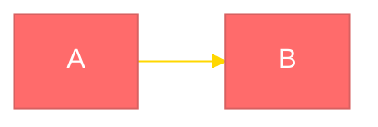
````

# Sample Flow Chart, with Clickable Link
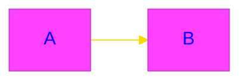

### Color Formats

Mermaid supports **both hex codes and human-readable color names**:

| Format | Example | Notes |
|---|---|---|
| Hex | `'#ff6b6b'` | Full control, always works |
| Named | `red` | Convenient, CSS color names supported |
| Mixed | `primaryColor: '#1a3a5c'` + `lineColor: gold` | Use both freely |

> **Analyst Tip:** Hex codes give you precision. Named colors give you speed. Use named colors for quick drafts and hex for mission-critical submissions.

### Legacy Syntax - Init Directive

The older `%%{init}%%` directive is still supported but must be on a **single line**:

````
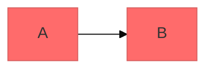
````

The frontmatter config is preferred - it's multi-line, readable, and what the Mermaid project recommends.

[pagebreak]

### Structure

The config block takes two primary keys. Understand both before you start charting mission-critical data:

| Key | Purpose |
|---|---|
| `theme` | Base theme (`base`, `default`, `dark`, `forest`, `neutral`) |
| `themeVariables` | Fine-grained overrides specific to the chart type |

> **Analyst Tip:** Always default to `'theme': 'base'` unless instructed otherwise. It applies the minimum possible styling, which means your `themeVariables` overrides will land with full effect. Any other base theme carries pre-loaded opinions about colour that will fight your overrides.

> [!warning] Dark Mode Title Caveat
> The `titleColor` variable controls **both** the chart title and section/segment labels in diagrams like Gantt. On dark backgrounds, if you set `titleColor` to white for the title, your section labels (which sit on coloured bars) may become unreadable. Choose a **neutral mid-tone** like `gray` or `silver` that reads against both dark backgrounds and coloured segments.

### Per-Chart Theme Variables

This is where it gets granular. Every diagram type - flowchart, sequence, XY, state - exposes its own set of `themeVariables` keys. They are **not interchangeable**. A key that controls background colour in an XY chart does nothing in a pie chart.

Before styling any new diagram type you haven't worked with before, pull the reference docs:

[Mermaid Theme Variable Reference](https://mermaid.js.org/config/theming.html#theme-variables)

For example, XY charts use a nested object under the `xyChart` key specifically:

```
 themeVariables:
 xyChart:
    backgroundColor: '#9955cc'
    plotColorPalette: '#ff6b6b,#4ecdc4'
```

No other chart type accepts an inner `xyChart` object. Others, like `pie`, `flowchart`, and `sequenceDiagram`, use flat top-level keys such as `primaryColor`, `actorBkg`, or `signalColor`. Check the docs. Every time.

### Syntax Rules - Non-Negotiable

These are not suggestions. Malformed config will silently fail and you will spend an hour wondering why the ship's hull integrity chart is rendering in lavender:

- Frontmatter config uses **YAML syntax** - no braces, no quotes around keys, indent with spaces
- `plotColorPalette` takes a **comma-separated list of hex codes**, applied to data series in order - no spaces between values
- Config blocks are **locally scoped** - they only affect the chart they sit inside. Other diagrams in your document are unaffected
- Use `'base'` theme when you want your themeVariables to take effect - other themes ignore them

---
[pagebreak]

## Chart Library - Reference Examples

The following are typed, annotated examples representing actual mission data visualisation patterns you will encounter on the NEXUS expedition. Each demonstrates a specific theming technique. Study them, then adapt them to your own data sets.

---

### Default Render - App Theme Applied

No config, no overrides. This is what you get when you trust the terminal. Acceptable for internal draft work. Not acceptable for formal mission reports or [[Mission Log]] submissions.

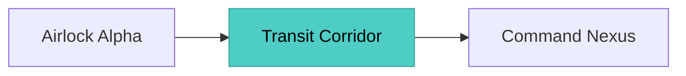
---

[pagebreak]


### Full Config Override - Chromatic Signal Flowchart - For Dark Mode

Full palette override using frontmatter config. Use this pattern for any decision-flow diagram submitted to [[Mission Log]] or [[Orbital Mechanics]] reports.


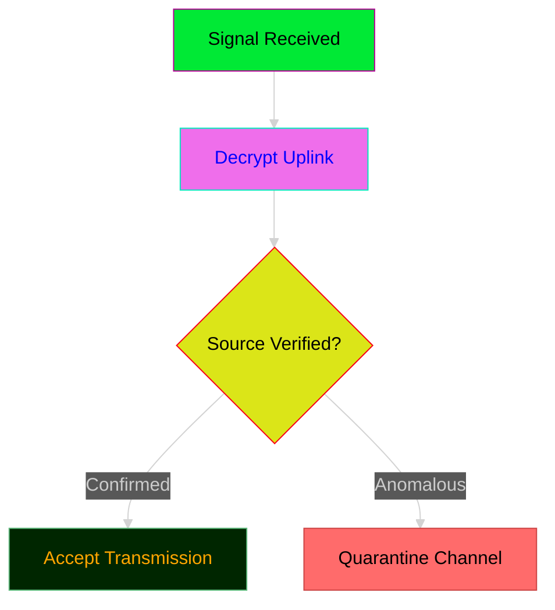

---

### Per-Node Inline Styling - No Config Required

When you only need to distinguish a handful of nodes - say, mapping the physical topology of the ship - skip the config block entirely and apply `style` tags per node. Faster, leaner, effective for [[Habitat Design]] documentation.

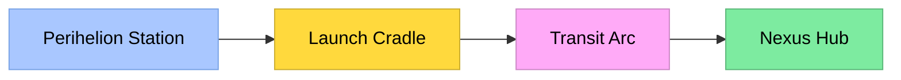

---
[pagebreak]


### Sequence Diagram - Crew Uplink Exchange

Sequence diagrams are critical for logging real-time crew communications in mission reports. The keys here are `actorBkg`, `actorTextColor`, `signalColor`, `noteBkgColor`, and `noteTextColor`. These render the actor panels and message lines - the most readable elements of the diagram.

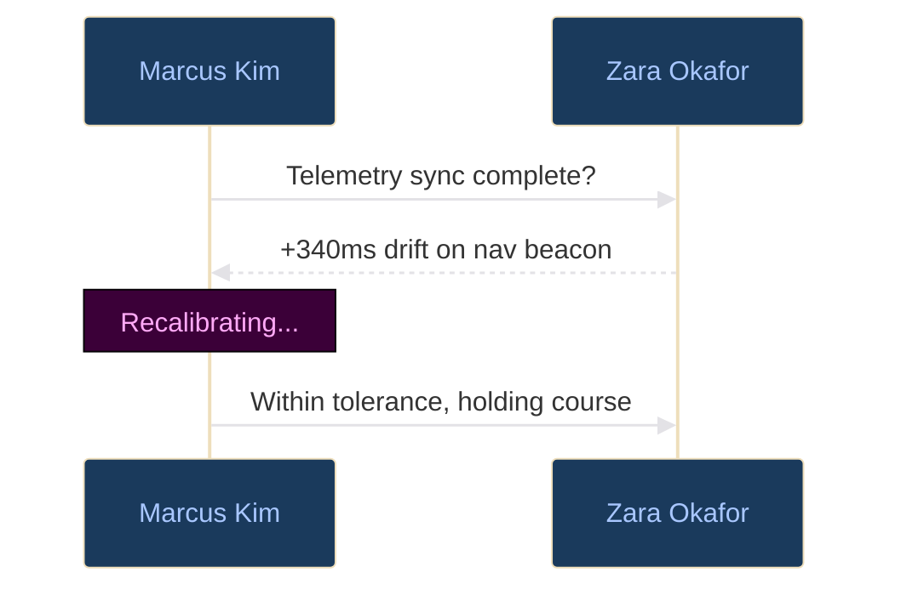

---
[pagebreak]

### Pie Chart - Mind Your Theme Background!
> [!warning] Dark on Dark? You're fired and ejected into space, amogus style

Power allocation data. Submitted alongside [[Habitat Design]] proposals. Default theme version - use only when visual fidelity is not mission-critical. Notice theme disruption in the label.

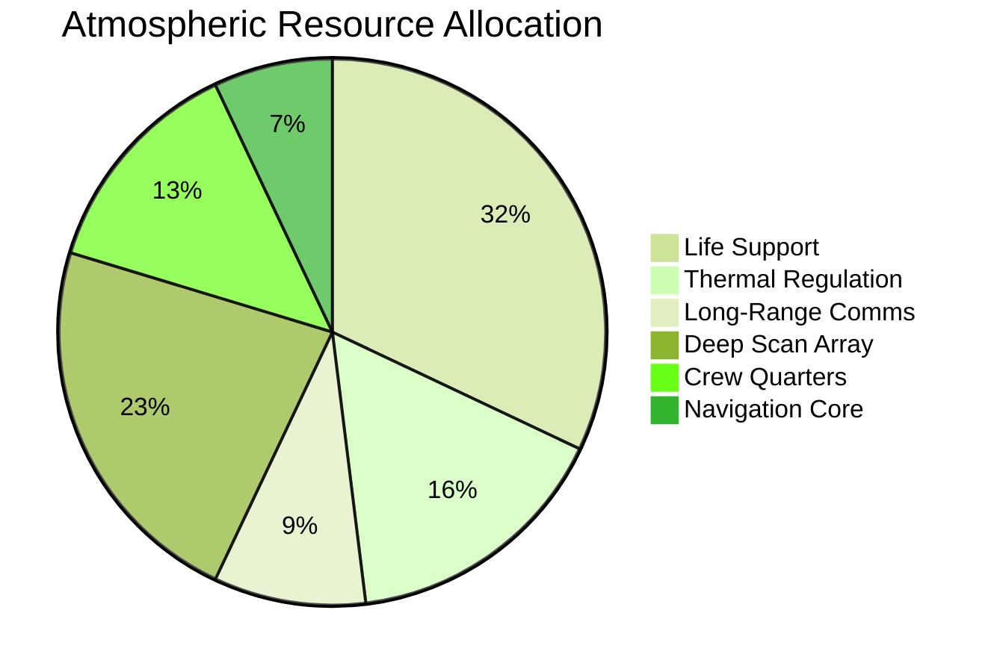


---

### Pie Chart - Custom Config Override

Same allocation data. This version is formatted for formal submission to [[Mission Log]]. Using named colors for readability.

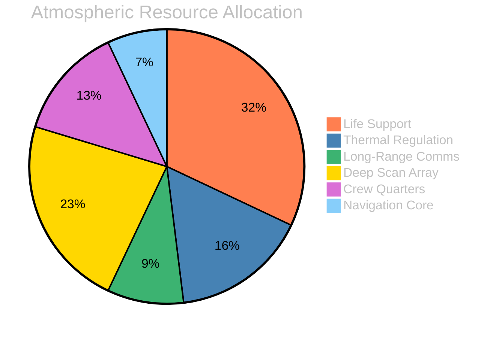

---

[pagebreak]

### Gantt Chart - Mission Sprint Schedule

Use Gantt charts when logging operational phases for [[Mission Log]] sprint reviews. Note the use of both hex and named colors. The `titleColor` is set to `silver` - a neutral tone that reads against both the dark background and colored task bars.

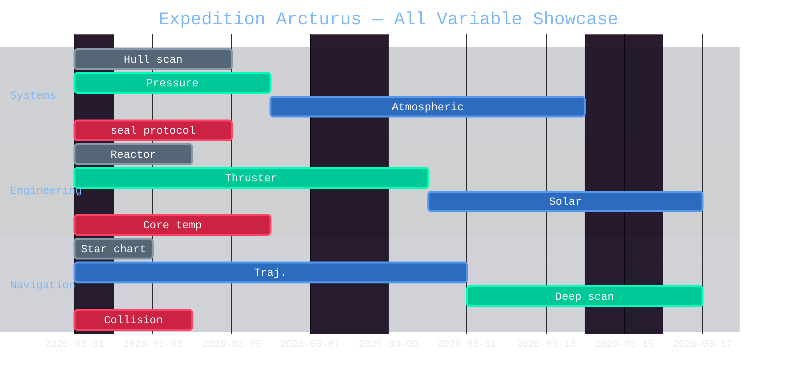

Use Gantt charts when logging operational phases for [[Mission Log]] sprint reviews. Note the use of both hex and named colors. The `titleColor` is set to `silver` - a neutral tone that reads against both the dark background and colored task bars.

Here are all the Mermaid Gantt-relevant `themeVariables` you can set when using the `base` theme:

---

**General / Shared**

| Variable | Purpose |
|---|---|
| `primaryColor` | Background of section rows (alternating 1) |
| `primaryTextColor` | Text color in primary sections |
| `primaryBorderColor` | Border color for primary elements |
| `secondaryColor` | Background of section rows (alternating 2) |
| `secondaryTextColor` | Text color in secondary sections |
| `secondaryBorderColor` | Border color for secondary elements |
| `tertiaryColor` | Background of section rows (alternating 3) |
| `tertiaryTextColor` | Text color in tertiary sections |
| `tertiaryBorderColor` | Border color for tertiary elements |
| `background` | Overall diagram background color |
| `mainBkg` | Main background (similar to background) |
| `lineColor` | Grid lines and axis lines |
| `titleColor` | Title text color |
| `textColor` | General fallback text color |
| `fontSize` | Base font size (e.g. `'16px'`) |
| `fontFamily` | Font family string |

---

**Gantt-Specific**

| Variable | Purpose |
|---|---|
| `gridColor` | Vertical grid line color |
| `todayLineColor` | Color of the "today" marker line |
| `taskBkgColor` | Default task bar fill color |
| `taskTextColor` | Text inside default task bars |
| `taskTextOutsideColor` | Task label text rendered outside the bar |
| `taskTextLightColor` | Task text on light-colored bars |
| `taskTextDarkColor` | Task text on dark-colored bars |
| `taskTextClickableColor` | Text color for clickable task labels |
| `taskBorderColor` | Border of default task bars |
| `activeTaskBkgColor` | Fill color for `active` tasks |
| `activeTaskBorderColor` | Border color for `active` tasks |
| `doneTaskBkgColor` | Fill color for `done` tasks |
| `doneTaskBorderColor` | Border color for `done` tasks |
| `critBkgColor` | Fill color for `crit` tasks |
| `critBorderColor` | Border color for `crit` tasks |
| `critTextColor` | Text color inside `crit` task bars |
| `sectionBkgColor` | Background of odd sections |
| `sectionBkgColor2` | Background of even sections |
| `altSectionBkgColor` | Alternating section background |
| `sectionLabelColor` | Color of section header labels |
| `excludeBkgColor` | Background color of excluded days/ranges |

---

>[!info] Gantt Chart Custom Items 

Here are all the Mermaid Gantt chart `themeVariables` relevant to coloring:

| Variable | Affects |
|---|---|
| `taskBkgColor` | Default/future task fill |
| `taskBorderColor` | Default/future task border |
| `taskTextColor` | Text on dark-background tasks |
| `taskTextDarkColor` | Text rendered in dark color (light tasks) |
| `taskTextLightColor` | Text rendered in light color (dark tasks) |
| `taskTextOutsideColor` | Task label text when rendered outside the bar |
| `taskTextClickableColor` | Text color for clickable tasks |
| `activeTaskBkgColor` | Active task fill |
| `activeTaskBorderColor` | Active task border |
| `doneTaskBkgColor` | Done task fill |
| `doneTaskBorderColor` | Done task border |
| `critBkgColor` | Critical task fill |
| `critBorderColor` | Critical task border |
| `todayLineColor` | The "today" vertical marker line |
| `gridColor` | Grid line color |
| `sectionBkgColor` | Alternating section background (odd) |
| `sectionBkgColor2` | Alternating section background (even) |
| `altSectionBkgColor` | Alternate section band fill |
| `titleColor` | Chart title text |
| `textColor` | General text (axis labels, section labels) |
| `edgeLabelBackground` | Background behind edge labels |

---

---

[pagebreak]

### State Diagram - System Operational States

Use state diagrams to document the operational lifecycle of any mission-critical system. Essential for [[Habitat Design]] documentation when systems have fault and recovery states.

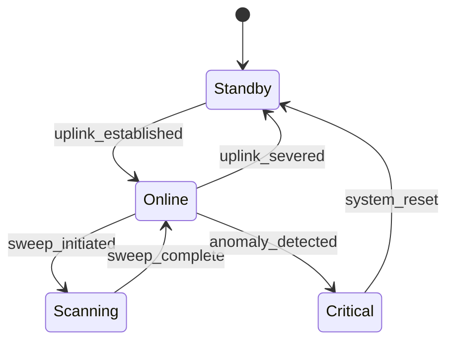

---

### Class Diagram - Ship Systems Architecture

Class diagrams document the structural architecture of the NEXUS vessel for engineering handoffs. File these under [[Habitat Design]] and cross-reference with [[Orbital Mechanics]] when propulsion classes are involved.

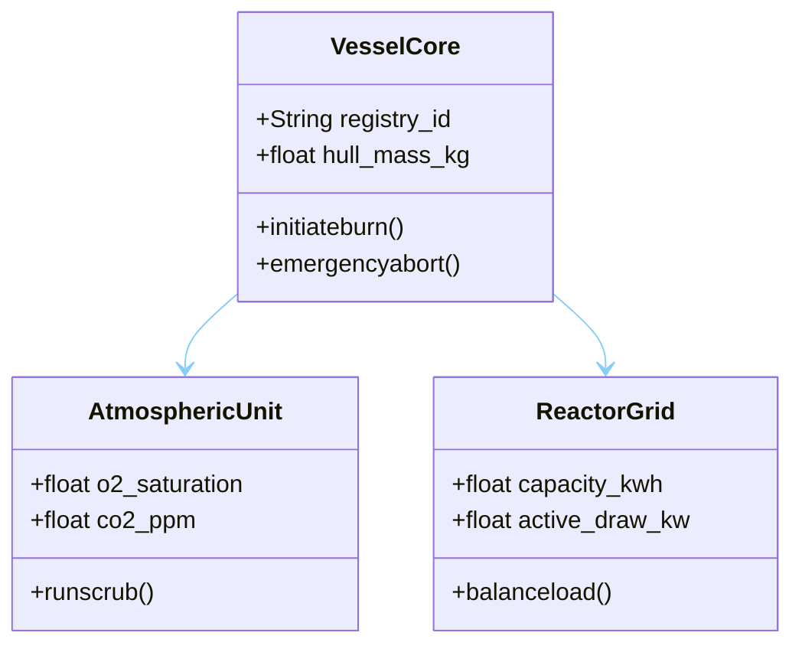

---

### ER Diagram - Mission Data Schema

Entity-relationship diagrams are used to document the data architecture of the expedition's operational database. File all ER diagrams with the [[Mission Log]] data team. Purple palette is reserved for database and schema documentation.

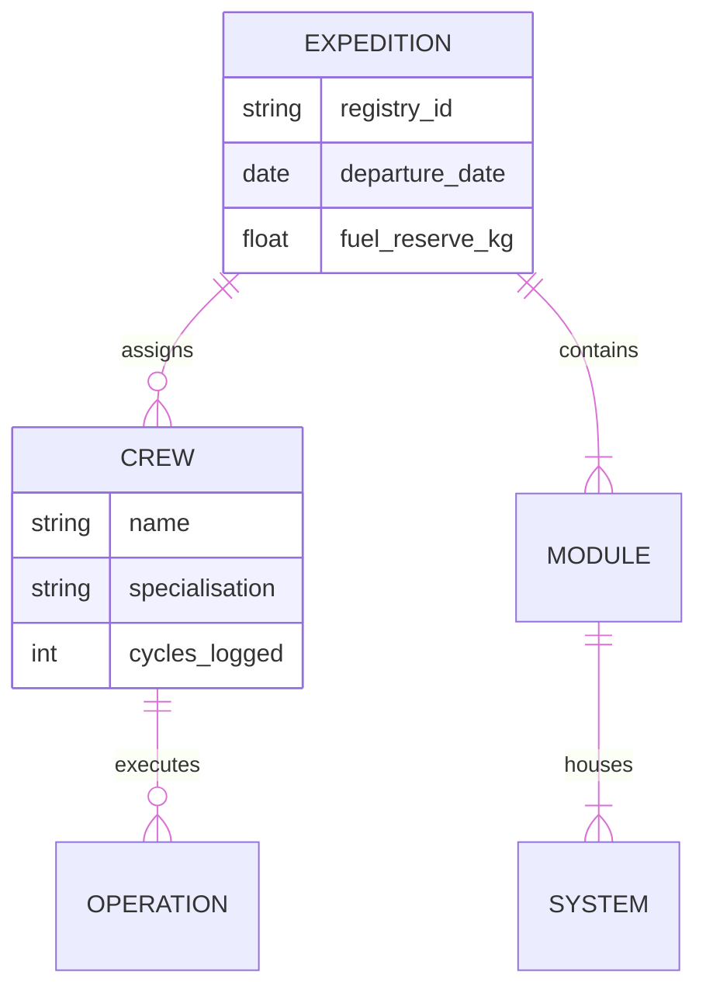

---

### Git Graph - Codebase Version Control

Use git graphs to document software patch histories for onboard systems. These are required entries in the [[Mission Log]] whenever a critical system receives a firmware update.

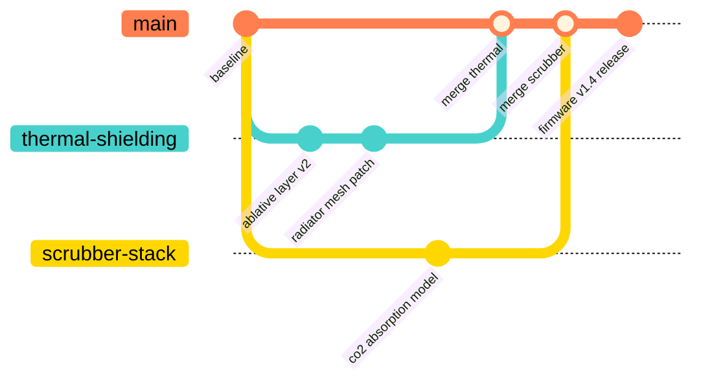

### Quadrant Chart - System Risk Assessment Matrix

Quadrant charts are used for mission risk prioritisation briefings. Plot all active systems by impact and risk rating at each sprint review.

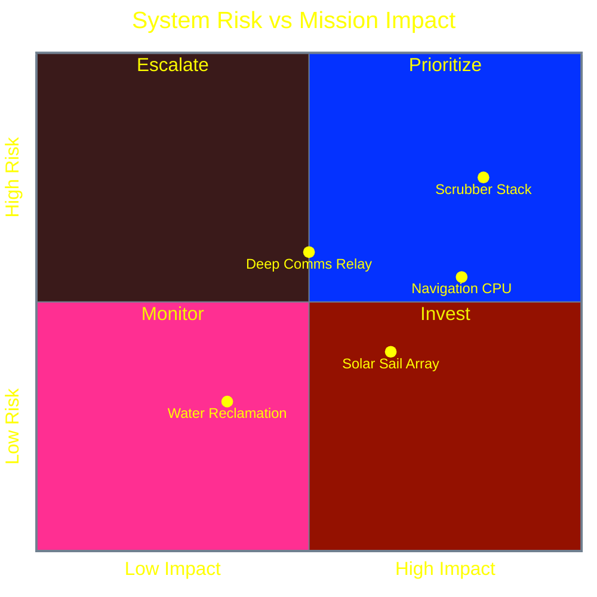

---

### Timeline - Expedition Arcturus Master Chronology

Timelines are the canonical chronological record for the expedition. One master timeline must exist in the [[Mission Log]] vault at all times.

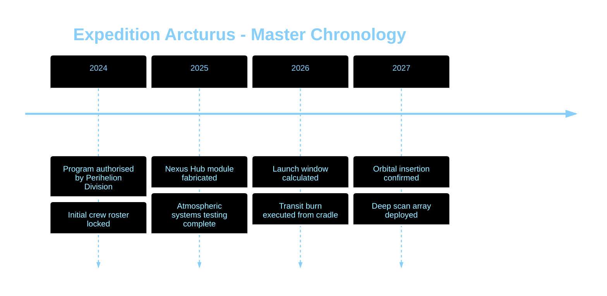

---

### XY Chart - System Draw vs Projected Load

XY charts are your primary tool for overlaying actual telemetry against projected baselines. Note the nested `xyChart` object inside `themeVariables` - this is unique to XY charts and is not used by any other diagram type.

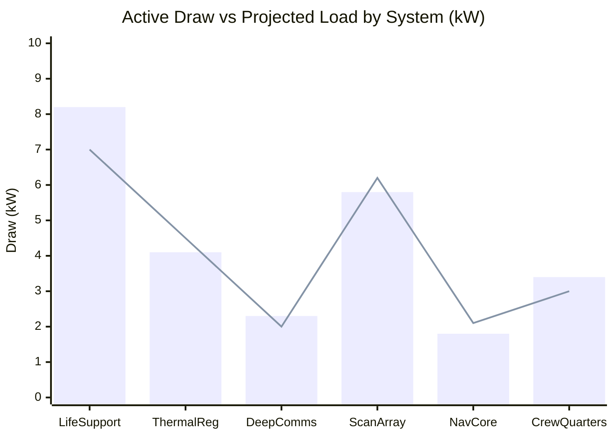

---

## Quick Reference - Analyst Colour Standards

The following palette is standardised across all NEXUS expedition documentation. Do not deviate from these assignments without written authorisation from the lead analyst. Both hex codes and named equivalents are listed where applicable. 

<div style="color: #333; font-weight: bold; background: LightBlue; padding: 10px; border: 1px solid #ccc;">Option+Click to use Color Picker to Insert Any Color at the Cursor Position!</div>

| Colour | Hex | Name | Swatch | Assigned Use |
|---|---|---|---|---|
| Deep Navy | `#1a3a5c` | - | <span style="display:inline-block;width:60px;height:20px;background-color:#1a3a5c;border:1px solid #444;border-radius:3px;"></span> | Primary backgrounds - [[Orbital Mechanics]], navigation |
| Signal Teal | `#4ecdc4` | `mediumturquoise` | <span style="display:inline-block;width:60px;height:20px;background-color:#4ecdc4;border:1px solid #444;border-radius:3px;"></span> | Active states, confirmed data, safe margins |
| Warning Amber | `#ffd93d` | `gold` | <span style="display:inline-block;width:60px;height:20px;background-color:#ffd93d;border:1px solid #444;border-radius:3px;"></span> | Line connectors, caution thresholds, phase transitions |
| Breach Red | `#ff6b6b` | `coral` | <span style="display:inline-block;width:60px;height:20px;background-color:#ff6b6b;border:1px solid #444;border-radius:3px;"></span> | Critical states, fault conditions, quarantine flags |
| Pulse Violet | `#9955cc` | `mediumpurple` | <span style="display:inline-block;width:60px;height:20px;background-color:#9955cc;border:1px solid #444;border-radius:3px;"></span> | Database schema, ER diagrams, data architecture |
| Crew Pink | `#ffaaf7` | `hotpink` | <span style="display:inline-block;width:60px;height:20px;background-color:#ffaaf7;border:1px solid #444;border-radius:3px;"></span> | Crew-facing systems, habitat, life support annotations |
| Growth Green | `#7deba0` | `mediumseagreen` | <span style="display:inline-block;width:60px;height:20px;background-color:#7deba0;border:1px solid #444;border-radius:3px;"></span> | Confirmed safe, merged, resolved, within tolerance |
| Ghost White | `#e3e2e6` | `silver` | <span style="display:inline-block;width:60px;height:20px;background-color:#e3e2e6;border:1px solid #444;border-radius:3px;"></span> | Primary text on dark backgrounds |
| Void Black | `#0d0d0d` | `black` | <span style="display:inline-block;width:60px;height:20px;background-color:#0d0d0d;border:1px solid #444;border-radius:3px;"></span> | Deep backgrounds, base layers |
| Link Blue | `#a9c7ff` | `lightskyblue` | <span style="display:inline-block;width:60px;height:20px;background-color:#a9c7ff;border:1px solid #444;border-radius:3px;"></span> | Actor text, node labels, hyperlink elements |

---

## Common Errors - Field Diagnosis

These are the failures you will encounter. Most analysts encounter them within the first two mission cycles. None of them are interesting the second time.

**Config not firing - chart renders in default theme**
Your YAML indentation is off. Config blocks use spaces, not tabs. Every key must be indented under its parent. If your themeVariables aren't applying, check that `theme: 'base'` is set - other themes ignore custom variables.

**Colours applying to wrong series**
`plotColorPalette` assigns colours in the order they are listed to series in the order they are declared. If your bar is rendering teal and your line is rendering red when you wanted the inverse, swap the hex values in the palette string - not in the chart body.

**Nested `xyChart` key not working**
You are either using it outside of an `xychart-beta` block, or you have placed it at the top level of `themeVariables` instead of nested inside an `xyChart:` object. Review the XY chart example above.

**State or sequence diagram ignoring `primaryColor`**
These diagram types use specialised keys - `actorBkg`, `actorTextColor`, `signalColor` for sequence; standard primary keys for state. Check the Mermaid theme variables reference linked above for the exact key names for your diagram type.

**Node `style` tag overriding config unexpectedly**
Inline `style` tags on individual nodes take precedence over config theme variables for that node. This is intentional and useful for highlighting anomalies. If a node is ignoring your global theme, check whether a `style` tag exists for it in the chart body.

**Title colour bleeding into segment labels**
The `titleColor` variable controls both the chart title and section labels in some diagram types (notably Gantt). Use a neutral mid-tone (`silver`, `gray`) that reads against both dark backgrounds and coloured segments. There is no separate variable for segment labels.

---

## Filing Protocol

All diagrams produced using this guide must be filed according to the following conventions:

- Flowcharts documenting system topology -> tag `#nexus`, link `[[Habitat Design]]`
- Sequence logs of crew communications -> tag `#perihelion`, link `[[Mission Log]]`
- Burn windows, orbital phase charts, Gantt schedules -> tag `#science`, link `[[Orbital Mechanics]]`
- Risk matrices and quadrant assessments -> tag `#perihelion` `#nexus`, link `[[Mission Log]]`
- All schema and data architecture diagrams -> tag `#nexus`, link `[[Mission Log]]`

When in doubt, link `[[Mission Log]]`. It is the canonical record. Everything else is a branch.


## Theme Variables - Full Reference

> Source: [Mermaid Theming Guide](https://mermaid.js.org/config/theming.html)

### Base Variables

| Variable | Default | Description |
|---|---|---|
| darkMode | false | Affects how derived colors are calculated |
| background | #f4f4f4 | Background color for contrast calculation |
| fontFamily | trebuchet ms | Font family for all diagram text |
| fontSize | 16px | Base font size |
| primaryColor | #fff4dd | Background in nodes - other colors derive from this |
| primaryTextColor | auto | Text color in primary-colored nodes |
| secondaryColor | auto | Derived from primaryColor |
| tertiaryColor | auto | Derived from primaryColor |
| lineColor | auto | Derived from background |
| textColor | auto | Text on background (titles, labels, signals) |
| mainBkg | auto | Background in flowchart objects, classes, sequences |

### Flowchart Variables

| Variable | Default | Description |
|---|---|---|
| nodeBorder | primaryBorderColor | Node border color |
| clusterBkg | tertiaryColor | Subgraph background |
| clusterBorder | tertiaryBorderColor | Subgraph border |
| titleColor | tertiaryTextColor | Chart title color |
| nodeTextColor | primaryTextColor | Text inside nodes |

### Sequence Diagram Variables

| Variable | Default | Description |
|---|---|---|
| actorBkg | mainBkg | Actor box background |
| actorTextColor | primaryTextColor | Actor label text |
| signalColor | textColor | Message line color |
| signalTextColor | textColor | Message text color |
| noteBkgColor | #fff5ad | Note background |
| noteTextColor | #333 | Note text |
| labelBoxBkgColor | actorBkg | Label background |
| labelTextColor | actorTextColor | Label text |

### Pie Diagram Variables

| Variable | Default | Description |
|---|---|---|
| pie1-pie12 | auto | Section fill colors (12 slots) |
| pieOpacity | 0.7 | Section opacity - **set to 1 on dark backgrounds** |
| pieTitleTextColor | auto | Title text color |
| pieSectionTextColor | textColor | Text on pie slices |
| pieLegendTextColor | auto | Legend label color |

### Gantt Variables

| Variable | Notes |
|---|---|
| titleColor | **Shared** between chart title and section labels - use neutral tone |
| taskBkgColor | Background of task bars |
| taskTextColor | Text on task bars |
| activeTaskBkgColor | Background of active tasks |
| doneTaskBkgColor | Background of completed tasks |
| critBkgColor | Background of critical tasks |
| gridColor | Grid line color |
| todayLineColor | Today marker line |

### State & Class Variables

| Variable | Default | Description |
|---|---|---|
| labelColor | primaryTextColor | State label color |
| altBackground | tertiaryColor | Deep composite state background |
| classText | textColor | Class diagram text |

### XY Chart Variables (nested under `xyChart:`)

| Variable | Description |
|---|---|
| backgroundColor | Chart background |
| plotColorPalette | Comma-separated hex colors for data series |

---

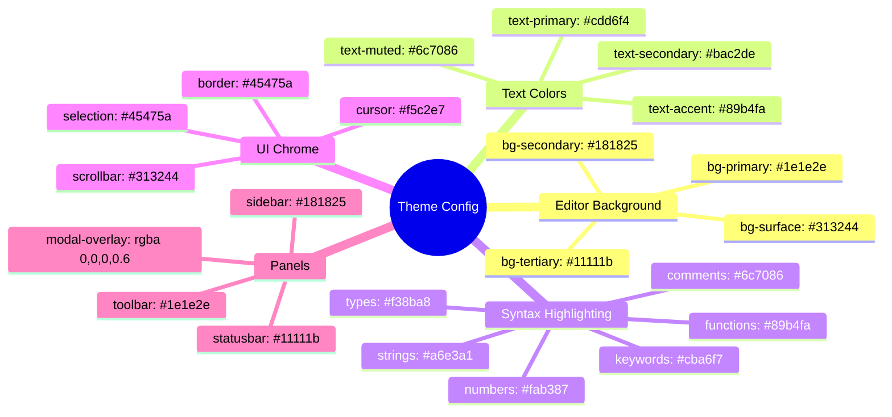
[pagebreak]

# Sankey 

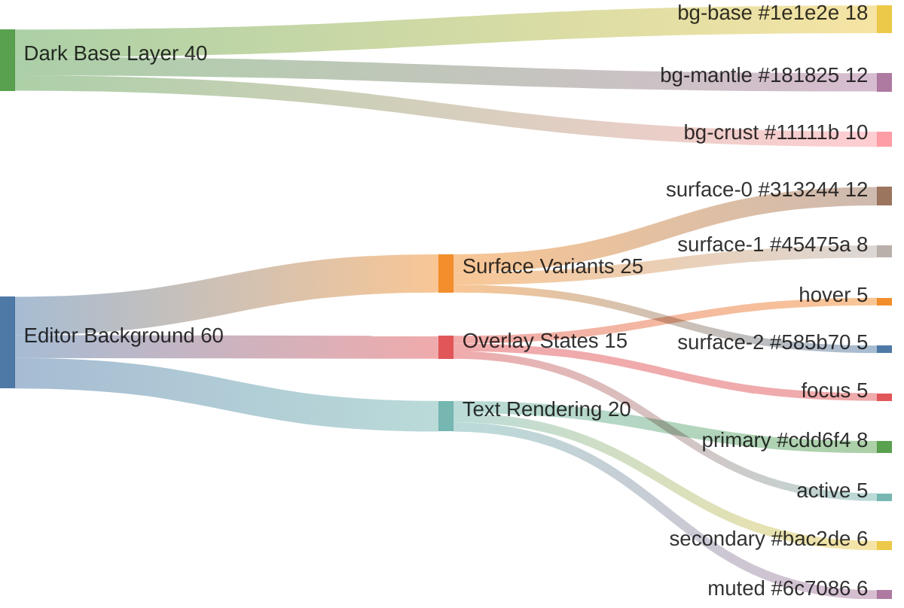

# Mermaid Theme Tests

> [!info] 
There are scenarios where custom preview background theme colors interfere with default Mermaid theme colors - here are some examples of how to customize your mermaid diagrams 

## Using Mermaid Init Directives

The `%%{init: {...}}%%` directive lets you customise a diagram's appearance at the top of any Mermaid block. It overrides global theme settings on a **per-chart basis**.

### Basic Syntax

Place the directive on the **first line** of your Mermaid block, before the diagram type declaration:

> [!example] 
%%{init: {'theme': 'base', 'themeVariables': { ... }}}%%
xychart-beta


### Structure

The init object accepts two main keys:

| Key | Purpose |
|---|---|
| `theme` | Base theme (`base`, `default`, `dark`, `forest`, `neutral`) |
| `themeVariables` | Fine-grained overrides specific to the chart type |

> **Tip:** `'theme': 'base'` is the most customisable - it applies minimal default styling, giving your `themeVariables` full effect.

### Per-Chart Theme Variables

Each diagram type exposes its own set of `themeVariables`. Always refer to the relevant section in the official docs:

📖 **Mermaid Theme Variables Reference](https://mermaid.js.org/config/theming.html#theme-variables)**

For example, XY charts use a nested object under `xyChart`:

```
'themeVariables': {
  'xyChart': {
    'backgroundColor': '#9955cc',
    'plotColorPalette': '#ff6b6b,#4ecdc4'
  }
}
```

Other chart types (e.g. `pie`, `flowchart`, `sequence`) use **different keys** - check the docs for the specific diagram type you are working with.

### Notes

- The directive must be **valid JSON-like syntax** - use single quotes as shown
- `plotColorPalette` accepts a **comma-separated list** of hex colours, applied to series in order
- Directives only affect the chart they are declared in - other diagrams in your document are unaffected


## Default (uses app theme)

```mermaid
flowchart LR
    A[Start] --> B[Process]
    B --> C[End]

```

## Custom Colors via Init Directive

```mermaid
%%{init: {'theme': 'base', 'themeVariables': {'primaryColor': '#ff6b6b', 'primaryTextColor': '#000', 'primaryBorderColor': '#cc4444', 'lineColor': '#ffd93d', 'secondaryColor': '#4ecdc4', 'tertiaryColor': '#1a1a2e'}}}%%
flowchart TD
    A[Red Node] --> B[Teal Node]
    B --> C{Decision}
    C -->|Yes| D[Go]
    C -->|No| E[Stop]
    style B fill:#4ecdc4,stroke:#3ba8a0,color:#000
    style D fill:#7deba0,stroke:#5cb87a,color:#000
    style E fill:#ff6b6b,stroke:#cc4444,color:#000
```

## Per-Node Styling (no init needed)

```mermaid
flowchart LR
    A["Mission Control"]
    B["Launch Pad"]
    C["Orbit"]
    D["Station"]
    
    A --> B
    B --> C
    C --> D
    
    style A fill:#a9c7ff,stroke:#7aa3e5,color:#000
    style B fill:#ffd93d,stroke:#ccae31,color:#000
    style C fill:#ffaaf7,stroke:#cc88c6,color:#000
    style D fill:#7deba0,stroke:#5cb87a,color:#000
```


## Sequence with Custom Theme

```mermaid
%%{init: {'theme': 'base', 'themeVariables': {'actorBkg': '#1a3a5c', 'actorTextColor': '#a9c7ff', 'signalColor': '#e3e2e6', 'labelBoxBkgColor': '#262a31', 'labelTextColor': '#e3e2e6', 'noteBkgColor': '#3b0038', 'noteTextColor': '#ffaaf7'}}}%%
sequenceDiagram
    participant E as Elena
    participant M as Marcus
    E->>M: Updated mass budget?
    M-->>E: +340kg for scrubber
    Note over E: Recalculating...
    E->>M: Within margin, barely
```

## Pie with Default Theme

```mermaid
pie title Power Budget
    "Life Support" : 8.2
    "Thermal" : 4.1
    "Comms" : 2.3
    "Science" : 5.8
    "Crew" : 3.4
    "GN&C" : 1.8
```

## Pie with Custom Theme Colors

```mermaid
%%{init: {'theme': 'base', 'themeVariables': {'primaryColor': '#1a3a5c', 'primaryTextColor': '#a9c7ff', 'primaryBorderColor': '#4a7abf', 'lineColor': '#ffd93d', 'secondaryColor': '#3b0038', 'tertiaryColor': '#1a1a3f'}}}%%
pie title Power Budget
    "Life Support" : 8.2
    "Thermal" : 4.1
    "Comms" : 2.3
    "Science" : 5.8
    "Crew" : 3.4
    "GN&C" : 1.8
```

## Gantt with Default Theme

```mermaid
gantt
    title Sprint Tasks
    dateFormat YYYY-MM-DD
    section Design
        Habitat review     :done, d1, 2026-03-18, 5d
        Power analysis     :active, d2, 2026-03-23, 5d
    section Engineering
        Scrubber redesign  :crit, e1, 2026-03-20, 10d
        Solar expansion    :e2, after e1, 5d
```

## State Diagram with Custom Theme

```mermaid
%%{init: {'theme': 'base', 'themeVariables': {'primaryColor': '#1a3a5c', 'primaryTextColor': '#a9c7ff', 'primaryBorderColor': '#4a7abf', 'lineColor': '#ffd93d', 'secondaryColor': '#3b0038', 'tertiaryColor': '#1a1a2e'}}}%%
stateDiagram-v2
    [*] --> Idle
    Idle --> Active : power_on
    Active --> Processing : task_received
    Processing --> Active : task_complete
    Active --> Error : fault_detected
    Error --> Idle : reset
    Active --> Idle : power_off
```

## Class Diagram with Init Directive

```mermaid
%%{init: {'theme': 'base', 'themeVariables': {'primaryColor': '#1a2a1a', 'primaryTextColor': '#7deba0', 'primaryBorderColor': '#5cb87a', 'lineColor': '#a9c7ff', 'secondaryColor': '#1a1a2e', 'tertiaryColor': '#0d0d0d'}}}%%
classDiagram
    class Spacecraft {
        +String id
        +float mass_kg
        +launch()
        +abort()
    }
    class LifeSupport {
        +float o2_level
        +float co2_ppm
        +scrub()
    }
    class PowerSystem {
        +float capacity_kwh
        +float draw_kw
        +balance()
    }
    Spacecraft --> LifeSupport
    Spacecraft --> PowerSystem
```

## ER Diagram with Custom Colors

```mermaid
%%{init: {'theme': 'base', 'themeVariables': {'primaryColor': '#2a1a3a', 'primaryTextColor': '#9955cc', 'primaryBorderColor': '#9955cc', 'lineColor': '#9955cc', 'secondaryColor': '#9955cc'}}}%%
erDiagram
    MISSION ||--o{ CREW : assigns
    MISSION ||--|{ MODULE : contains
    CREW ||--o{ TASK : performs
    MODULE ||--|{ SYSTEM : houses
    MISSION {
        string id
        date launch_date
        float budget_usd
    }
    CREW {
        string name
        string role
        int hours_logged
    }
```

## Git Graph with Custom Theme

```mermaid
%%{init: {'theme': 'base', 'themeVariables': {'git0': '#ff6b6b', 'git1': '#4ecdc4', 'git2': '#ffd93d', 'git3': '#ffaaf7', 'gitBranchLabel0': '#000', 'gitBranchLabel1': '#000', 'gitBranchLabel2': '#000', 'gitInv0': '#000', 'gitInv1': '#000', 'gitInv2': '#000'}}}%%
gitGraph
    commit id: "init"
    branch thermal-fix
    checkout thermal-fix
    commit id: "insulation v2"
    commit id: "radiator patch"
    checkout main
    branch scrubber-redesign
    commit id: "co2 model"
    checkout main
    merge thermal-fix id: "merge thermal"
    merge scrubber-redesign id: "merge scrubber"
    commit id: "release v1.4"
```

## Quadrant Chart with Per-Node Styling

```mermaid
%%{init: {'theme': 'base', 'themeVariables': {'primaryColor': '#1a1a2e', 'primaryTextColor': '#e3e2e6', 'primaryBorderColor': '#4a4a6a', 'lineColor': '#a9c7ff', 'quadrant1Fill': '#1a3a1a', 'quadrant2Fill': '#3a1a1a', 'quadrant3Fill': '#1a1a3a', 'quadrant4Fill': '#2a2a1a', 'quadrantTitleFill': '#e3e2e6'}}}%%
quadrantChart
    title System Risk vs Impact
    x-axis Low Impact --> High Impact
    y-axis Low Risk --> High Risk
    quadrant-1 Prioritize
    quadrant-2 Escalate
    quadrant-3 Monitor
    quadrant-4 Invest
    Scrubber: [0.82, 0.75]
    Solar Array: [0.65, 0.40]
    Comms Relay: [0.50, 0.60]
    Guidance CPU: [0.78, 0.55]
    Water Reclaim: [0.35, 0.30]
```

## Timeline with Custom Theme

```mermaid
%%{init: {'theme': 'base', 'themeVariables': {'primaryColor': '#1a3a5c', 'primaryTextColor': '#a9c7ff', 'primaryBorderColor': '#4a7abf', 'lineColor': '#ffd93d', 'secondaryColor': '#3b0038', 'tertiaryColor': '#1a2a1a'}}}%%
timeline
    title Mission Arcturus Timeline
    2024 : Program kickoff
         : Initial crew selection
    2025 : Habitat module complete
         : Life support testing
    2026 : Launch window opens
         : Transit burn executed
    2027 : Orbital insertion
         : Surface ops begin
```

## XY Chart with Init Directive

```mermaid
%%{init: {'theme': 'base', 'themeVariables': {'xyChart': {'backgroundColor': '#9955cc', 'plotColorPalette': '#ff6b6b,#4ecdc4,#ffd93d'}}}}%%
xychart-beta
    title "Power Draw by System (kW)"
    x-axis [Life Support, Thermal, Comms, Science, GN&C, Crew]
    y-axis "Draw (kW)" 0 --> 10
    bar [8.2, 4.1, 2.3, 5.8, 1.8, 3.4]
    line [7.0, 4.5, 2.0, 6.2, 2.1, 3.0]
```
[[Mission Log]] | [[Mission Briefing]] | [[Orbital Mechanics]] | [[Welcome]] | [[Zara Okafor]] | [[Dr. Elena Vasquez]]
---

*Field Guide v3.0 - Perihelion Division Analyst Corps - Expedition Arcturus*
*Last updated: cycle 2026-03 - next review scheduled at orbital insertion*
