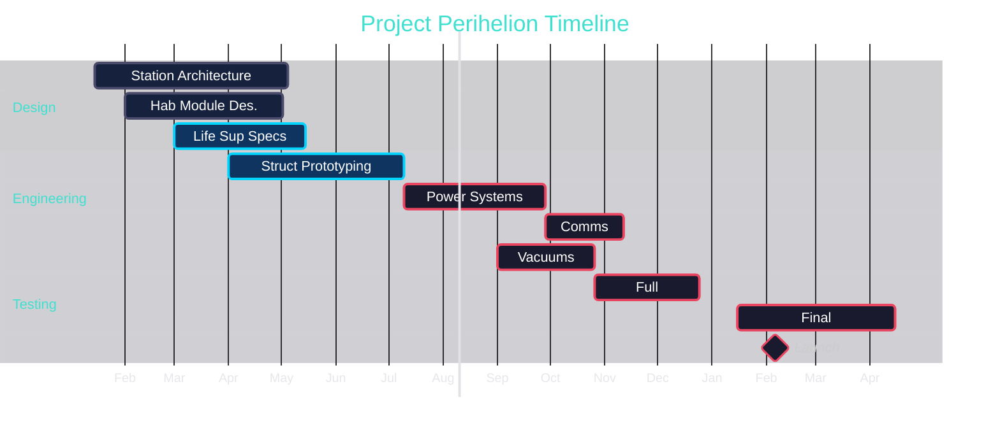
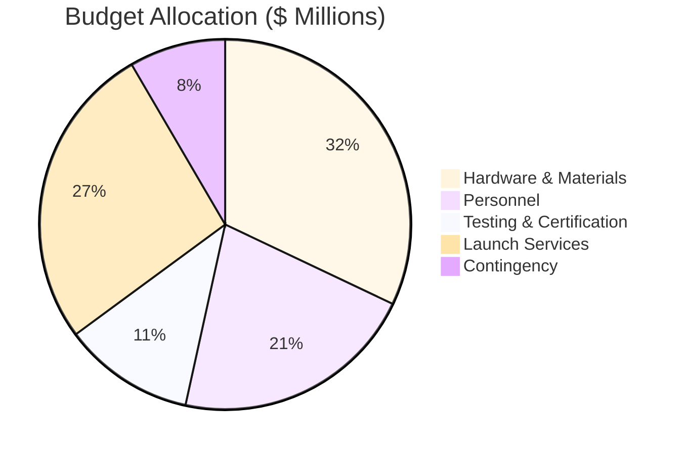

# Mission Briefing: Project Perihelion

**Objective:** Design, build, and deploy a 12-person commercial research station in Low Earth Orbit by Q4 2027. 

**Mission Lead:** [[Zara Okafor]]
**Science Lead:** [[Dr. Elena Vasquez]]
**Systems Lead:** [[Marcus Kim]] 

## Timeline

## Budget Overview

## Key Risks 

> [!danger] Launch Window 
> The February 2027 window is non-negotiable. Miss it and we wait 8 months for the next orbital alignment. See [[Orbital Mechanics#Transfer Windows]] for the math.

> [!warning] Life Support Redundancy
> Current design has single-point-of-failure in CO2 scrubbing. [[Marcus Kim]] is leading the redesign. Tracked in [[Sprint Review 2026-03-25]].

> [!success] Habitat Module
> Structural design passed all simulation loads. [[Habitat Design]] is approved for prototyping.

## Related

- [[System Architecture]] - full technical diagram
- [[Orbital Mechanics]] - trajectory and orbit calculations
- [[Sprint Review 2026-03-25]] - latest progress

#mission #perihelion #planning

