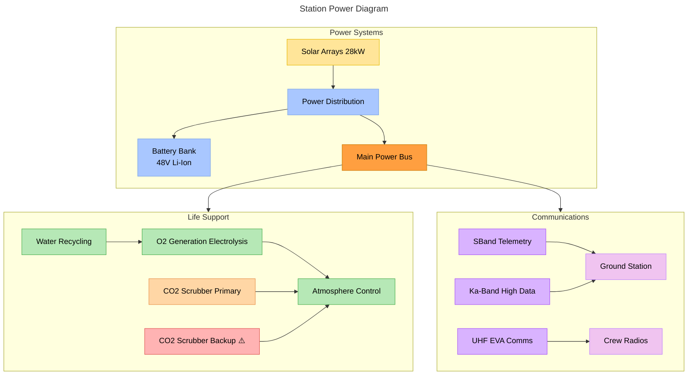
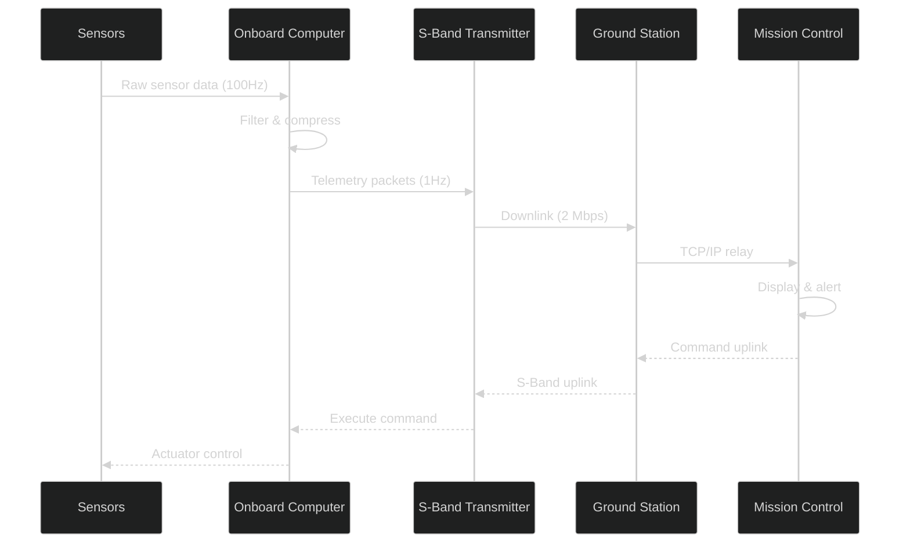
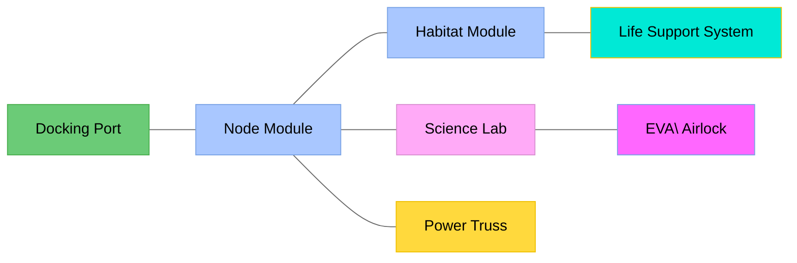

# System Architecture

> [!note] Owner
> Maintained by [[Marcus Kim]]. All changes require review.
## Station Systems Overview

## Data Flow: Telemetry Pipeline

## Module Layout

## Power Budget

| System | Power Draw | Priority |
|--------|-----------|----------|
| Life Support | 8.2 kW | 🔴 Critical |
| Thermal Control | 4.1 kW | 🔴 Critical |
| Communications | 2.3 kW | 🟡 High |
| Science Payloads | 5.8 kW | 🟢 Normal |
| Crew Systems | 3.4 kW | 🟢 Normal |
| GN&C | 1.8 kW | 🔴 Critical |
| **Total** | **25.6 kW** | - |
| **Available (Solar)** | **28.0 kW** | - |
| **Margin** | **2.4 kW (8.6%)** | ⚠️ |

> [!warning] Power Margin
> 8.6% margin is below our 15% target. Options under review:
> 1. Add two more solar panels (+4 kW, +180 kg) - impacts [[Orbital Mechanics]]
> 2. Reduce science payload priority to load-shed during eclipse
> 3. Upgrade to higher-efficiency GaAs cells (+$2.1M) - impacts [[Mission Briefing|budget]]

## Related

- [[Mission Briefing]] - timeline and budget
- [[Marcus Kim]] - system owner
- [[Habitat Design]] - interior integration points
- [[Orbital Mechanics]] - mass budget constraints

#engineering #architecture #power #systems

