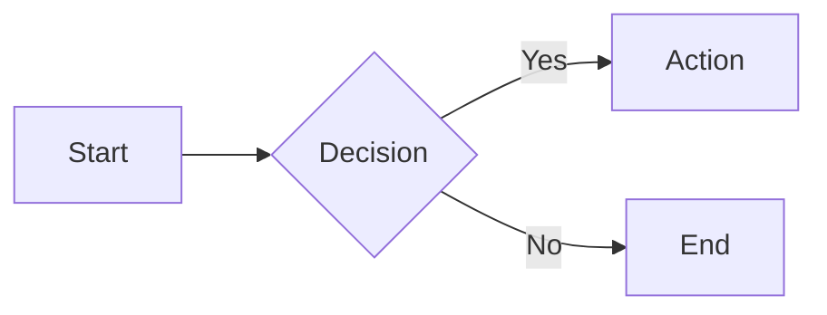

# cyberWriter User Guide

**cyberWriter** is a native macOS Markdown editor that transforms your documents into beautifully formatted PDFs and Word documents with zero external dependencies. No Pandoc, no LaTeX, no command-line tools required. 

*Made by with love JT @ UncSoft*


---

## Contents
- [Getting Started](#getting-started) · [Power Features](#power-features) · [Quick Tips for Perfect PDFs](#quick-tips-for-perfect-pdfs)
- [Markdown Syntax](#markdown-syntax-reference) · [LaTeX Math](#latex-math) · [Mermaid Diagrams](#mermaid-diagrams) · [CSS Styling](#css-styling) · [The Editor](#the-editor)
- [AI Workspace](#ai-workspace) · [Presentation Mode](#presentation-mode) · [Voice Recording & Transcription](#voice-recording-transcription) · [Media Embeds](#media-embeds)
- [File Vault Support](#file-vault-support) · [Find & Replace](#find-replace) · [Preview Themes](#preview-themes) · [Exporting Documents](#exporting-documents)
- [Keyboard Shortcuts](#keyboard-shortcuts) · [Working with Images](#working-with-images) · [File Formats](#file-formats) · [Support](#support)

---

## Getting Started

cyberWriter provides a distraction-free writing environment with a live preview. Simply start typing in the editor on the left, and watch your formatted document appear on the right.

### Smart Features

**Smart Filename Suggestion:** As you type, cyberWriter automatically suggests a filename based on your document's first heading or first line of text. The window title updates in real-time, and when you save, the suggested name appears in the Save dialog.

**Drag & Drop:** Drag markdown files directly onto the cyberWriter window to open them. You can also drag files onto the dock icon.

### View Modes

Use the view mode picker in the toolbar or keyboard shortcuts to switch between:

| Mode | Shortcut | Description |
|------|----------|-------------|
| Editor Only | `⌘1` | Full-screen editing |
| Split View | `⌘2` | Side-by-side editor and preview |
| Preview Only | `⌘3` | Full-screen preview |

### Templates

Quickly start new documents with pre-built templates. Go to **File > New from Template** and choose from:

| Template | Description |
|----------|-------------|
| **README** | Standard project readme with sections for features, installation, and usage |
| **Meeting Notes** | Structured format with date, attendees, agenda, and action items |
| **Blog Post** | Article layout with introduction, sections, and conclusion |
| **Project Plan** | Planning document with objectives, milestones, tasks, and risks |
| **Changelog** | Keep a Changelog format for tracking project versions |

**Tip:** You can also insert template content into an existing document by right-clicking in the editor and selecting from the **Templates** submenu.

**Template Picker:** When you create a new blank document, a template picker overlay appears automatically. Click any template to start with that structure, or choose "Blank" to start with a heading prompt.

**Custom Templates:** Save any document as a reusable template via **File > Save as Template**, right-click > **Save as Template**, or the command palette. Your templates appear in the template picker and the New from Template menu. Manage them in **File > New from Template > Open Templates Folder**.

### Command Palette

Press `⌘/` to open the **Command Palette** — a searchable popup with quick access to every action in cyberWriter. Type to filter, arrow keys to navigate, Enter to execute.

The palette includes 80+ commands across all categories:
- **Formatting** — headings, bold, italic, code, strikethrough, highlight, superscript, subscript
- **Blocks** — code blocks, blockquotes, tables, page breaks, footnotes, table of contents
- **Lists** — bullet, numbered, task lists
- **Diagrams** — all 16 Mermaid diagram types
- **CSS Styles** — colored text, alignment, underline, boxes
- **Templates** — README, Meeting Notes, Blog Post, Project Plan, Changelog
- **View** — editor/split/preview modes, focus mode, outline, PDF preview
- **AI** — toggle AI panel, quick actions
- **Export** — quick PDF, export with options, save to vault, save as template
- **Voice** — record voice note, record & transcribe, live dictation
- **Settings** — toggle line numbers, scroll sync, spell check, hex color collapse

Each command shows its keyboard shortcut (if available) so you can learn shortcuts over time.

---

[pagebreak]

## Power Features

These capabilities set cyberWriter apart from other Markdown editors:

### Drag & Drop Images

Drag images directly into the editor or paste from clipboard with `⌘V`. cyberWriter automatically:
- Saves the image to an `images/` folder next to your document
- Inserts the Markdown reference at your cursor
- Displays the image instantly in the preview

Works with screenshots, images from browsers, and files from Finder.

### Document Map

Click the **grid icon** in the PDF preview toolbar to see all pages at once in a zoomable grid. Perfect for:
- Navigating large documents instantly
- Checking overall layout and flow
- Spotting formatting issues across pages

Use `⌘+` and `⌘-` to zoom the entire map, or scroll to explore.

### Live PDF Preview

Edit your document while viewing it as a PDF. Changes render in real-time, so you see exactly how your exported PDF will look - including page breaks, margins, and formatting.

Press `⌘P` to toggle PDF preview mode.

### Auto Table of Contents

Press `⌘⇧T` or use **Insert > Table of Contents** to instantly generate a clickable table of contents from all your headings. The TOC includes:
- Proper indentation by heading level
- GitHub-style anchor links that work in previews and exports
- Automatic updates when you regenerate

### Outline Sidebar

Press `⌘⇧O` to open a sidebar showing all headings in your document. Click any heading to jump directly to it. The outline updates as you type and shows visual hierarchy with color coding.

### Focus Mode

Press `⌘⇧F` to enter distraction-free writing mode. All toolbars and chrome disappear, leaving just your content centered on screen. Move your mouse to reveal controls.

### Presentation Mode

Click the **play button** in the editor toolbar to choose **Play as Slides** or **Flash Cards**. Also available from the command palette (`⌘/`).

#### Slides

Your document is split into slides by `---` horizontal rules. If no dividers are found, slides are split by `##` or `###` headings instead. Each slide renders with full Markdown formatting — code blocks, images, tables, callouts, Mermaid diagrams, and KaTeX math.

A **title slide** is auto-generated from YAML frontmatter (`title`, `author`, `date`, `tags`) or the first heading and file metadata.

Long slides are scrollable — a subtle gradient and chevron at the bottom indicate when there's more content.

| Key | Action |
|-----|--------|
| `←` `→` | Previous / Next slide |
| `Space` | Play / Pause auto-advance |
| `R` | Toggle shuffle |
| `W` | Cycle layout: Standard / Wide / Card |
| `+` `-` | Zoom in / out (50%–200%) |
| `F` | Toggle fullscreen |
| `?` | Help |
| `Esc` | Exit |

**Layout modes:** Standard (1100px max), Wide (full width), Card (700px).

**Format with AI:** Click **?** → "Format with AI" to have the AI restructure your document with `---` dividers and headings for better slides.

#### Flash Cards

Separate cards with `---` and split question from answer with `???`:

```
What is the capital of France?

???

Paris

---

Next question

???

Next answer
```

- **Click anywhere** or press **Space** to reveal the answer
- Questions appear in a blue-bordered card, answers in green
- Cards without `???` show as question-only (no reveal needed)
- You can use any Markdown in questions and answers

**Spaced Repetition (SM-2):** After revealing an answer, rate your recall:

| Key | Rating | Effect |
|-----|--------|--------|
| `1` | Again | Card comes back in 1 day |
| `2` | Hard | Short interval, ease decreases |
| `3` | Good | Normal interval |
| `4` | Easy | Longer interval, ease increases |

Cards you struggle with appear more often. Your progress is saved automatically to a `.flashcards.json` file next to the document and persists between sessions. Click the **reset button** (↺) in the controls bar to clear all progress.

The due count is shown in the controls bar. Shuffle mode randomizes order while keeping Q&A paired.

**Tip:** Paste study material and ask the AI: *"Turn these notes into flash cards using --- and ??? syntax"* — the system prompt knows the format.

### Hex Color Picker

cyberWriter displays inline color swatches next to `#hex` color codes in the editor. The `#` symbol shows as a colored block matching the hex value.

- **Option-click** any hex color code to open the system color picker and edit it live
- **Option-click** elsewhere in the editor to insert a new hex color at the cursor
- The picker stays open for multiple inserts — move your cursor and pick another color
- Works with 3, 4, 6, and 8 character hex codes

### LaTeX Math

Render mathematical expressions with KaTeX:

- **Inline math:** `$E = mc^2$` renders as $E = mc^2$
- **Block math:** Use `$$...$$` for display equations:

```
$$\sum_{i=1}^{n} x_i = x_1 + x_2 + \cdots + x_n$$
```

$$\sum_{i=1}^{n} x_i = x_1 + x_2 + \cdots + x_n$$

Math renders in preview and PDF exports.

### Resizable Sidebar

Drag the inner edge of the sidebar panel to resize it (260–500pt). Each window remembers its own width. The panel supports both the AI and Files tabs at any size.

---

[pagebreak]

## Quick Tips for Perfect PDFs

Getting your PDF to look just right is easy with these formatting tools:

### Page Breaks

If your PDF is clipping text or splitting content awkwardly between pages, use **page breaks** to take control:

```markdown
[pagebreak]
```

Insert `[pagebreak]` before headings, tables, or images to ensure they start on a fresh page. This is especially useful for:
- Keeping tables from being split across pages
- Starting new chapters or sections on their own page
- Preventing images from being cut off

### Fine-Tuning Your Layout

In the **PDF Export Preview** (click Export), you can adjust:

| Setting | What It Does |
|---------|--------------|
| **Paper Size** | Choose Letter, A4, Legal, or other sizes to fit your content |
| **Orientation** | Switch to Landscape for wide tables or images |
| **Margins** | Increase margins for binding, or decrease for more content per page |
| **Font Size** | Scale text larger for readability or smaller to fit more content |

### Pro Tips

- **Wide tables getting cut off?** Try Landscape orientation or reduce margins
- **Text too small in print?** Increase the font size scale in export settings
- **Want consistent formatting?** Check "Remember settings" to save your preferences
- **Preview before exporting** - the thumbnail view shows exactly how each page will look

---

## Markdown Syntax Reference

> **Tip:** No need to memorize all this syntax! cyberWriter offers several convenient ways to insert Markdown:
> - **Right-click** in the editor to open the Insert menu (select text first to access formatting options like bold and italic)
> - Click the **+ button** in the toolbar for quick access to all Markdown elements
> - Use **Edit > Insert** from the menu bar
> - Use **keyboard shortcuts** such as `⌘B` for bold, `⌘I` for italic, and `⌘K` for links

[pagebreak]

### Text Formatting

| Style | Syntax | Result |
|-------|--------|--------|
| Bold | `**bold**` | **bold** |
| Italic | `*italic*` | *italic* |
| Bold Italic | `***bold italic***` | ***bold italic*** |
| Strikethrough | `~~strikethrough~~` | ~~strikethrough~~ |
| Inline Code | `` `code` `` | `code` |
| Highlight | `==highlight==` | ==highlight== |

### Headings

```markdown
# Heading 1
## Heading 2
### Heading 3
#### Heading 4
##### Heading 5
###### Heading 6
```
[pagebreak]

# Heading 1
## Heading 2
### Heading 3
#### Heading 4
##### Heading 5
###### Heading 6

### Links and Images

**Hyperlink:**
```markdown
[Link Text](https://example.com)
```

**Image:**
```markdown

```

**HTML Image with Size:**
```html

```

### Lists

**Bullet List:**
```markdown
- Item one
- Item two
- Item three
```

**Numbered List:**
```markdown
1. First item
2. Second item
3. Third item
```

**Task List:**
```markdown
- [x] Completed task
- [ ] Pending task
```
- [x] Completed task
- [ ] Pending task

### Code Blocks

Wrap code in triple backticks with an optional language identifier for syntax highlighting:

````markdown
```swift
func greet(name: String) {
    print("Hello, \(name)!")
}
```
````

```swift
func greet(name: String) {
    print("Hello, \(name)!")
}
```

Supported languages include: Swift, Python, JavaScript, TypeScript, SQL, HTML, CSS, JSON, Bash, and many more.

### Blockquotes

```markdown
> This is a blockquote.
> It can span multiple lines.
```

> This is a blockquote.
> It can span multiple lines.

### Tables

```markdown
| Header 1 | Header 2 | Header 3 |
|----------|----------|----------|
| Cell 1   | Cell 2   | Cell 3   |
| Cell 4   | Cell 5   | Cell 6   |
```

### Horizontal Rule

```markdown
---
```

---


### Page Breaks

Insert a page break for PDF export:

```markdown
[pagebreak]
```

### Footnotes

```markdown
Here is a sentence with a footnote[^1].

[^1]: This is the footnote content.
Footnotes appear at the bottom of the page
```
[^1]: This is the footnote content.

---

## LaTeX Math

cyberWriter renders mathematical expressions using KaTeX. Both inline and block math are supported in the preview and all export formats.

### Inline Math

Wrap expressions in single dollar signs: `$x^2 + y^2 = r^2$` renders as $x^2 + y^2 = r^2$.

### Block Math

Use double dollar signs for centered display equations:

```
$$\int_0^\infty e^{-x^2} dx = \frac{\sqrt{\pi}}{2}$$
```

$$\int_0^\infty e^{-x^2} dx = \frac{\sqrt{\pi}}{2}$$

### Common LaTeX Syntax

| Expression | Syntax | Result |
|-----------|--------|--------|
| Superscript | `$x^2$` | $x^2$ |
| Subscript | `$x_i$` | $x_i$ |
| Fraction | `$\frac{a}{b}$` | $\frac{a}{b}$ |
| Square root | `$\sqrt{x}$` | $\sqrt{x}$ |
| Greek letters | `$\alpha, \beta, \gamma$` | $\alpha, \beta, \gamma$ |
| Summation | `$\sum_{i=1}^n$` | $\sum_{i=1}^n$ |

---

[pagebreak]

## CSS Styling

cyberWriter supports inline CSS for custom styling. These styles are preserved in PDF exports.

### Text Colors

```html
<span style="color: red;">Red text</span>
<span style="color: blue;">Blue text</span>
<span style="color: green;">Green text</span>
<span style="color: #ff6600;">Custom hex color</span>
```
[pagebreak]

<span style="color: red;">Red text</span>
<span style="color: blue;">Blue text</span>
<span style="color: green;">Green text</span>
<span style="color: #ff6600;">Custom hex color</span>

*Many more colors supported!*

### Text Alignment

```html
<div style="text-align: center;">Centered text</div>
<div style="text-align: right;">Right-aligned text</div>
```
Regular text
<div style="text-align: center;">Centered text</div>
<div style="text-align: right;">Right-aligned text</div>

### Text Size

```html
<span style="font-size: 18px;">Larger text</span>
<span style="font-size: 12px;">Smaller text</span>
```
<span style="font-size: 18px;">Larger text</span>
<span style="font-size: 12px;">Smaller text</span>


### Backgrounds and Borders

```html
<span style="background-color: yellow;">Highlighted</span>
<div style="border: 1px solid #ccc; padding: 10px;">Box with border</div>
```

<span style="background-color: yellow;">Highlighted</span>
<div style="border: 5px solid #aaa; padding: 10px;">Box with border</div>

### Underline

```html
<span style="text-decoration: underline;">Underlined text</span>
```
<span style="text-decoration: underline;">Underlined text</span>

---

[pagebreak]

## Mermaid Diagrams

cyberWriter includes built-in support for Mermaid diagrams with live preview. Use the **Insert > Diagrams** menu or the **+** button to insert diagram templates.

### Supported Diagram Types

| Type | Description |
|------|-------------|
| **Flowchart** | Process flows and decision trees |
| **Sequence** | Interaction between components over time |
| **Class** | Object-oriented class relationships |
| **State** | State machines and transitions |
| **Gantt** | Project timelines and schedules |
| **Pie Chart** | Proportional data visualization |
| **ER Diagram** | Entity-relationship database models |
| **Mindmap** | Hierarchical idea organization |
| **Timeline** | Chronological events |
| **Git Graph** | Branch and merge visualization |
| **XY Chart** | Bar and line charts |
| **C4 Diagram** | Software architecture (Context, Container, Component) |
| **Sankey** | Flow and quantity visualization |
| **Quadrant** | Four-quadrant categorization |
| **Kanban** | Task board layout |
| **Tree Map** | Hierarchical data as nested rectangles |

### Writing Mermaid Diagrams

Wrap your diagram code in a mermaid code block:

````markdown

````


### Diagrams in Exports

- **PDF:** Diagrams render as SVG graphics
- **DOCX:** Diagrams are converted to PNG images and embedded
- **HTML:** Diagrams render interactively with Mermaid.js

---

[pagebreak]

## The Editor

### Editor Themes

cyberWriter includes multiple syntax highlighting themes for the editor. Click the paintbrush icon in the toolbar to select a theme.

**cyberWriter Themes (Recommended):**
- **Nabu Dark** - Custom theme with full Markdown highlighting (headings, bold, italic, links, code)
- **Nabu Light** - Light variant with the same rich Markdown support

**Dark Themes:**
Atom One Dark · Monokai · Dracula · Nord · Tomorrow Night · Solarized Dark

**Light Themes:**
Atom One Light · GitHub · Xcode · Solarized Light · Tomorrow

Choose **System** to automatically switch between Nabu Light and Nabu Dark based on your macOS appearance settings.

### Line Numbers

Toggle line numbers on/off using the line number button in the toolbar.

### Scroll Sync

cyberWriter can synchronize scrolling between the editor and preview. Enable it with the scroll sync button in the toolbar.

Two sync modes are available (toggle when scroll sync is enabled):

| Mode | Icon | Description |
|------|------|-------------|
| Line-based | Line icon | Accurate sync based on source line mapping. Best for documents with images or varied content. |
| Percentage | % icon | Smooth proportional scrolling. Best for text-heavy documents. |

**Smart pause:** If you manually scroll the preview to inspect something, scroll sync pauses automatically so it doesn't jump back. Sync resumes when you move the cursor to a different section of the document.

### Formatting Toolbar

The editor toolbar includes quick formatting buttons for the most common operations:

**Bold** · **Italic** · **Strikethrough** · **Code** · **Link** · **Highlight**

Select text and click a button to wrap it, or click with no selection to insert the syntax at the cursor. A **callout dropdown** is also available — click the speech bubble icon to insert any of the 11 callout block types.

### Insert Menu

Click the **+** button in the toolbar to quickly insert Markdown elements:
- Formatting (bold, italic, code, etc.)
- Headings (H1-H6)
- Lists (bullet, numbered, task)
- Links and images
- Code blocks, blockquotes, tables
- Page breaks, footnotes, and **Table of Contents**
- CSS styles (colors, alignment, boxes)
- **Mermaid diagrams** (16 types - flowcharts, sequence, gantt, and more)

### Table of Contents

cyberWriter can automatically generate a Table of Contents from your document headings. Press `⌘⇧T` or use **Insert > Table of Contents** to insert a TOC at the cursor position.

The generated TOC includes:
- All headings (H1-H6) in your document
- Proper indentation based on heading level
- GitHub-style anchor links for navigation

### Outline Sidebar

Toggle the **Outline Sidebar** to see a navigable list of all headings in your document. Click the outline icon in the editor toolbar or press `⌘⇧O`.

Features:
- Shows all headings with visual hierarchy
- Click any heading to jump to that location
- Color-coded by heading level (H1=blue, H2=green, H3=orange)
- Automatically updates as you edit

### Focus Mode

Enter **Focus Mode** for distraction-free writing by pressing `⌘⇧F` or clicking the glasses icon in the toolbar. Focus mode hides all toolbars and UI chrome, leaving just your content.

- Move your mouse to reveal the exit button
- Press `⌘⇧F` again or click the X to exit
- Toggle preview visibility while in focus mode

---

[pagebreak]

## AI Workspace

cyberWriter includes a built-in AI assistant that connects to local and cloud language models to help you write, generate content, and create diagrams.

### Opening the AI Panel

Press `⌘⇧A` or click the **sparkle icon** in the toolbar. The panel docks to the left or right of your editor (toggle the dock side with the sidebar icon in the panel header).

### Apple Intelligence

On supported hardware running macOS 26, **Apple Intelligence** works out of the box with zero configuration. No API keys, no downloads, no setup — just open the AI panel and start chatting.

Apple Intelligence runs entirely on-device using the Neural Engine. It appears automatically in **Settings > AI** when available. If no other model is configured, Apple Intelligence is used by default.

**Best for:** summaries, rewrites, grammar fixes, tone changes, quick Q&A, brainstorming, and formatting help. For complex reasoning or large document analysis, connect a cloud model.

### Chat with Your Vault

cyberWriter can index your entire vault on-device and feed the most relevant snippets to the AI automatically — so you can ask questions about anything you've written, across every file, without manually attaching context. Works with Apple Intelligence and every connected provider.

**How it works**

1. Open **Settings > AI > Vault Context** and click **Build Vault Embeddings**. cyberWriter chunks your Markdown files, runs each chunk through Apple's on-device text embedder (`NLContextualEmbedding`, 512-dim), and saves the vectors to `.vault.embeddings.json` at your vault root. A typical vault indexes in seconds.
2. First time only: if Apple's embedding model isn't downloaded yet you'll see **Download Apple's Embedding Model (~50 MB)**. Click and wait for the one-time download.
3. Toggle **Use vault embeddings as AI context** to send retrieved chunks with each AI query. Toggle **Auto-update when files change** (default on) so the index stays fresh in the background.

**Two places it shows up**

- **Vault sidebar search** grows a **Related Ideas** section beneath exact matches. Type a concept ("orbital mechanics", "leadership decisions") and files that talk about it surface even when they don't contain the exact words. Click to open.
- **AI chat** retrieves the top 5 most relevant chunks for every question and includes them (with filenames) in the system context. When the AI cites a file, the filename renders as a clickable link that opens the document in a new tab.

**Per-conversation toggle**

A small **Vault** pill next to the input area lets you turn vault context off for one chat without changing the global setting — useful for quick questions where you don't need the vault's help.

**Vault structure (optional)**

A second toggle in Settings, **Send vault structure with each request**, adds a compact file list so the AI can reference files that weren't in the top-5 retrieval. Adds ~30–60 characters per file to each request. Apple Intelligence stays fully on-device regardless; cloud providers see filenames when this is on (there's an inline warning in Settings).

**Privacy**

Embeddings never leave your Mac. Only the retrieved chunk text is sent to the AI, and only when the model you've selected is a remote one. If Apple Intelligence is your model, the whole flow is local.

**Inspect the index**

Click **View Vault Map** in Settings to generate a human-readable Markdown report showing every indexed file, chunk count, source file mtime, and any files that were skipped (binary, empty, etc.). Opens as a new untitled document you can save or copy excerpts from.

### Connecting a Model

Go to **Settings > AI** to configure your model. cyberWriter auto-detects local AI services running on your Mac:

| Provider | Default Port | Type |
|----------|-------------|------|
| **Apple Intelligence** | - | On-device (macOS 26+) |
| **Ollama** | 11434 | Local |
| **LM Studio** | 1234 | Local |
| **MLX** | 8080 | Local |
| **vLLM** | 8000 | Local |
| **OpenRouter** | - | Cloud (free + paid) |
| **Claude (Anthropic)** | - | Cloud (native API) |

Any **OpenAI-compatible** endpoint also works. Click **Test** to verify your connection, or **Fetch Models** to discover available models.

### Using the AI Assistant

1. Type your request in the input field and press Enter
2. The AI responds in the chat panel
3. Click **Insert into Editor** to add the response at your cursor (or replace selected text)

### Document Context

Click the **document icon** next to the input to attach your current document (or selection) as context. The AI can then reference your content when responding.

- Click the **context badge** to view and **edit** the scraped content before sending
- Add **Notes** in the context popover for persistent references - colors, file paths, style rules, constraints. Notes stay across messages so you don't retype them.

### File Attachments

Click the **paperclip icon** (📎) in the AI input bar to attach files as additional context:

- Supports `.md`, `.txt`, `.csv`, `.json`, `.yaml`, `.html`, `.swift`, `.py`, and other text files
- **PDF files** are supported — text is extracted page-by-page using PDFKit
- Attached files appear as blue badges showing filename and character count
- Click the **X** on a badge to remove it
- Files auto-clear after sending (notes persist)

### Stream into Editor

Toggle **Stream into Editor** to have AI responses type directly into your document at the cursor position. You'll see the text appear in the editor and the preview update in real-time.

- The entire streamed response is a single undo group - press `⌘Z` to reverse it all
- The response is also saved in the chat history for reference

### System Prompt

The system prompt in **Settings > AI** controls how the AI formats its responses. The default prompt instructs the AI to:
- Output raw Markdown, HTML/CSS, or Mermaid - no code fences (except for Mermaid blocks)
- No commentary or explanation unless asked
- Match the style of your existing document when context is provided

Customize the system prompt to suit your workflow. Changes save automatically.

### Tips

- **Use context** - attaching your document helps the AI match your style and avoid duplicating content
- **Be specific** - "Add a mermaid sequence diagram showing user login flow" works better than "add a diagram"
- **Iterate** - ask follow-up questions in the same conversation to refine results
- **Debug connections** - use the **cURL** button in AI Settings to copy a test command you can run in Terminal

---

[pagebreak]

## Voice Recording & Transcription

cyberWriter includes built-in voice recording with on-device speech transcription. Click the **microphone icon** in the editor toolbar to access three modes:

### Record Voice Note

Records audio to your vault's `audio/` folder as an `.m4a` file. When you stop, the audio embed is inserted at your cursor:

```
**Voice Note 2026-04-12 at 10.30.15**
![[audio/Voice Note 2026-04-12 at 10.30.15.m4a]]
```

The audio file plays directly in the preview with native controls.

### Record & Transcribe

Records audio like above, then automatically transcribes the recording using Apple's on-device speech recognition. The result is inserted as the audio embed followed by the transcription as a blockquote:

```
**Voice Note 2026-04-12 at 10.30.15**
![[audio/Voice Note 2026-04-12 at 10.30.15.m4a]]

> Transcribed text appears here...
```

### Live Dictation

Streams your speech directly to text in real time — no audio file is saved. The transcribed text appears in a floating preview panel as you speak, and is inserted into the editor when you stop.

Live dictation works in the background — you can switch to other apps while dictating.

**Access:** Mic dropdown in editor toolbar, right-click > Insert > Record Voice Note, or command palette (`⌘/`).

---

## Media Embeds

cyberWriter supports embedding multiple media types directly in your documents using the `![[filename]]` vault syntax:

| Syntax | Result |
|--------|--------|
| `![[recording.m4a]]` | Inline audio player (mp3, m4a, wav, aac, ogg, flac) |
| `![[clip.mp4]]` | Inline video player (mp4, mov, m4v, webm) |
| `![[document.pdf]]` | Scrollable PDF viewer |
| `![[data.csv]]` | Rendered HTML table (csv, tsv) |
| `![[document.rtf]]` | Formatted rich text content |
| `![[notes.txt]]` | Inline text content with accent border |
| `![[notes.md]]` | Rendered Markdown with full formatting |
| `![[image.png]]` | Inline image (existing) |

### YouTube Embeds

Paste a YouTube URL as a markdown link and it auto-embeds as a responsive video player in the preview:

```
[Video Title](https://www.youtube.com/watch?v=VIDEO_ID)
```

### Superscript & Subscript

- **Superscript:** `^text^` renders as ^text^ (e.g., E = mc^2^)
- **Subscript:** Use `<sub>text</sub>` for subscript (e.g., H<sub>2</sub>O)

Both are available from right-click > Insert > Formatting, or the command palette.

### Drag & Drop Embeds

Drag any non-markdown file from the vault sidebar into the editor to insert an embed link. Right-click > **Copy Wikilink** also uses the `![[path]]` embed syntax for media files.

All embedded media is encoded directly in HTML exports, making the output fully portable — share a single HTML file with all audio, video, and PDFs included.

---

## Find & Replace

cyberWriter includes powerful search capabilities to help you navigate and edit your documents.

### Quick Find (`⌘F`)

Press `⌘F` to open the search bar. Type to search and matches are highlighted in the editor.

- **Navigate matches** with the arrow buttons or press Enter
- **Close** with Escape or click the X button

### Enhanced Find (`⌘⌥F`)

Press `⌘⌥F` to open Enhanced Find with a results list showing all matches:

- **See all matches** in a scrollable list with line numbers
- **Click any result** to jump directly to that location
- **Context preview** shows surrounding text for each match
- **Replace mode** - click the replace icon to enable find & replace
- **Replace one** or **Replace All** with confirmation

### Find Shortcuts

| Shortcut | Action |
|----------|--------|
| `⌘F` | Quick Find |
| `⌘⌥F` | Enhanced Find with results list |
| `Escape` | Close search bar |

---

## Preview Themes

Select a preview theme from the palette menu in the toolbar. Preview themes affect the visual appearance of your document in the preview pane and in exported files.

| Theme | Background | Best For |
|-------|------------|----------|
| **Academic** | White | Papers, theses, formal documents |
| **Modern** | White | Tech docs, READMEs, clean layouts |
| **Sepia** | Warm cream | Long-form reading, books |
| **Night** | Dark gray | Dark mode PDFs, reduced eye strain |
| **Synthetic Editorial** | Deep navy | Modern dark aesthetic, AI-native feel |

### Custom Themes

Create your own preview/export themes with full control over colors and typography:

1. Open the theme picker in the toolbar and click **Custom Theme...**, or go to **Settings > Themes**
2. Click the **+ Custom** button to create a new theme (based on the currently selected one)
3. Customize colors (background, text, headings, links, code), fonts, and font size
4. Click any color swatch to open the **system color picker** with palettes, sliders, and color wheel
5. The live preview updates as you edit

You can also **right-click any theme** to duplicate it as a custom starting point. Custom themes appear in the toolbar theme picker alongside built-in themes and are used for both preview and export.

---

[pagebreak]

## File Vault Support

cyberWriter can open and browse markdown file vaults (or any folder of Markdown files) with full support for wikilinks, tags, callouts, and image embeds.

### Opening a Vault

1. Click the **folder icon** in the toolbar, or go to the **Files** tab in the sidebar
2. Click **Open Vault** to select an existing folder, or **Create Vault** to start fresh
3. The file browser shows all files with expandable folders
4. Click any file to open it in a new tab

Creating a vault defaults to `~/Documents` and seeds it with a Welcome note. The vault is remembered across sessions — it reopens automatically on next launch.

**Example Vault:** On first launch, cyberWriter installs a demo vault (Nexus Labs) showcasing wikilinks, tags, callouts, Mermaid diagrams, and more. Restore it anytime from **File > Restore Example Vault**.

### Wikilinks

cyberWriter supports extended markdown-style wikilinks:

| Syntax | Result |
|--------|--------|
| `[[Page Name]]` | Links to Page Name.md |
| `[[Page Name\|Display Text]]` | Shows "Display Text", links to Page Name.md |
| `[[Folder/Page]]` | Links to a file in a subfolder |
| `[[Page#Section]]` | Links to a specific heading |

- **Click** a wikilink in the preview to open the linked file in a new tab
- **Hover** over a wikilink to see a scrollable preview card with full formatting — CSS, callouts, images, and tags all render. Mermaid diagrams show as placeholders.
- Links are highlighted in the editor (blue in Nabu Dark theme)

### Media Embeds

Use `![[filename]]` to embed media from anywhere in your vault. cyberWriter searches the entire vault folder and renders the content inline in the preview and exports:

- `![[image.png]]` — images (png, jpg, gif, webp, svg)
- `![[recording.m4a]]` — audio player (mp3, m4a, wav, aac, ogg, flac)
- `![[clip.mp4]]` — video player (mp4, mov, m4v, webm)
- `![[document.pdf]]` — scrollable PDF viewer
- `![[data.csv]]` — rendered HTML table (csv, tsv)
- `![[document.rtf]]` — formatted rich text
- `![[notes.md]]` — rendered Markdown with full formatting
- `![[notes.txt]]` — inline text content

### Tags

Tags like `#project` and `#status/active` are highlighted in the editor and rendered as styled pills in the preview. Nested tags with `/` separators are supported.

### Callout Blocks

cyberWriter renders extended markdown-style callout blocks in the preview:

```
> [!note] Title
> Content goes here.
```

Supported types: **note**, **tip**, **warning**, **danger**, **info**, **success**, **question**, **quote**, **example**, **bug**, **abstract**, and aliases (hint, caution, faq, etc.).

### Knowledge Graph

cyberWriter can visualize your vault as an interactive knowledge graph showing files as nodes and wikilinks as edges.

- Click the **graph icon** in the toolbar or sidebar to open the graph in a floating window
- Nodes represent vault files, edges represent `[[wikilinks]]` between them
- The active file is highlighted; click any node to open that file
- The graph features slow orbit animation and tag-based hover labels
- Use **Tour Mode** to cycle through nodes automatically

### Backlinks

The **Backlinks** panel in the vault sidebar shows all files that link to the current document via `[[wikilinks]]`. Click any backlink to open that file.

### Full-Text Search

The vault sidebar search bar searches file names, tags, AND file contents. Content matches show a snippet of the matching line below the filename so you can find text across your entire vault without opening individual files.

### Quick Switcher

Quickly jump between vault files using the search bar at the top of the file browser. Type to filter by filename and click to open.

### Drag & Drop from Sidebar

Drag files from the vault sidebar directly into the editor:
- Drag a **.md file** to insert a `[[wikilink]]`
- Drag an **image file** to insert an `![[image embed]]`

### Dataview Queries

Dataview plugin queries (```` ```dataview ```` blocks) are displayed as styled info boxes. cyberWriter doesn't execute the queries, but renders them clearly so you know they're plugin content.

### Recent Files

The **Recents** section at the top of the Files tab shows your last 8 opened documents for quick access. Right-click any recent file to **Copy to Vault** — this copies the file into your vault folder.

### Save to Vault

Copy the current document into your vault from **File > Save to Vault**, right-click > **Save to Vault**, or the command palette. If the file is already in the vault, you'll be notified.

### Managing Your Vault

- **Search**: Use the search bar at the top of the file browser to filter by filename, tags, and content
- **Change Vault**: Click the vault menu icon in the header toolbar to switch vaults
- **Rescan**: Click the refresh icon to re-index after adding or removing files
- **New Note**: Click the + icon in the header to create a new note in the vault
- **Close Vault**: Click the X icon to disconnect the vault
- **Unsaved indicator**: Files with unsaved changes show a small dot next to their name
- **Folder state**: Collapsed/expanded folders are remembered across sessions

### Tips

- cyberWriter and other markdown vault apps can work on the same vault simultaneously - they both use plain Markdown files
- Use the AI Workspace (`⌘⇧A`) to ask questions about your vault notes or generate new content
- Export any vault note to PDF, Word, or HTML with custom themes
- Right-click files in the browser for **Reveal in Finder**, **Copy Path**, or **Copy Wikilink**

---

[pagebreak]

## Exporting Documents

### Quick Export (PDF)

Press `⌘E` or click the **Export** button for quick PDF export using your current settings.

### PDF Export with Preview

When exporting, you'll see a preview sheet with:

- **Page thumbnails** on the left (click to enlarge)
- **Settings panel** on the right

#### Page Setup Options

**Paper Size:**
- US Standard: Letter, Legal, Tabloid, Executive, Statement, Folio
- ISO A Series: A3, A4, A5, A6
- ISO B Series: B4, B5, B6
- Custom dimensions

**Orientation:**
- Portrait
- Landscape

**Margins:**
Adjustable margins for top, bottom, left, and right (in points, where 72 points = 1 inch).

**Page Range:**
Export specific pages instead of the full document. Enter single pages, ranges, or comma-separated lists:
- `3` — page 3 only
- `1-5` — pages 1 through 5
- `1-3, 5, 7-9` — pages 1–3, 5, and 7–9

**Page Numbers:**
- Enable/disable page numbers
- Position: Top or bottom, left/center/right
- Format: Arabic (1, 2, 3), Roman (i, ii, iii), Letters (A, B, C)

### DOCX Export

Export to Microsoft Word format (.docx) for editing in Word, Google Docs, or other word processors.

**DOCX Options:**
- Compatibility mode (Word 2007 through Word 365)
- Table of contents generation
- Heading styles for document outline

### HTML Export

Export your document as a standalone HTML file. The exported HTML includes all styling and can be opened in any web browser.

**Use cases:**
- Share documents via email or web
- Archive formatted documents
- Import into other systems that accept HTML

---

## Keyboard Shortcuts

### File Operations

| Shortcut | Action |
|----------|--------|
| `⌘N` | New document |
| `⌘O` | Open document |
| `⌘S` | Save |
| `⌘⇧S` | Save As |
| `⌘W` | Close window |
| `⌘T` | New tab |

### View

| Shortcut | Action |
|----------|--------|
| `⌘1` | Editor only |
| `⌘2` | Split view |
| `⌘3` | Preview only |
| `⌘⇧A` | Toggle AI Workspace |
| `⌘⇧O` | Toggle outline sidebar |
| `⌘⇧F` | Toggle focus mode |
| `⌘/` | Command Palette |
| `⌘⇧/` | Show keyboard shortcuts |

### Export

| Shortcut | Action |
|----------|--------|
| `⌘E` | Export to PDF |
| `⌘⇧E` | Export with options |

### Find

| Shortcut | Action |
|----------|--------|
| `⌘F` | Quick Find |
| `⌘⌥F` | Enhanced Find (with results list) |
| `Escape` | Close search |

### Editing

| Shortcut | Action |
|----------|--------|
| `⌘B` | Bold |
| `⌘I` | Italic |
| `⌘K` | Insert link |
| `⌘`` ` `` | Inline code |
| `⌘⇧T` | Insert Table of Contents |
| `⌘+` | Increase font size |
| `⌘-` | Decrease font size |
| `⌘0` | Reset font size |

### Text Navigation

| Shortcut | Action |
|----------|--------|
| `⌘←` | Jump to start of line |
| `⌘→` | Jump to end of line |
| `⌥←` | Jump word left |
| `⌥→` | Jump word right |
| `⌘↑` | Jump to start of document |
| `⌘↓` | Jump to end of document |

---

[pagebreak]

## Working with Images

### Local Images

For local images, cyberWriter needs folder access to display them in the preview. When you open a document with local image references, click the **folder icon** in the toolbar to grant access to the document's folder.

```markdown

```

### Web Images

Web images work without additional permissions:

```markdown

```

### Resizing Images

Use HTML for precise control over image dimensions:

```html

```

### Pasting Images from Clipboard

cyberWriter supports pasting images directly from your clipboard. Simply copy an image and paste with `⌘V` in the editor.

**Supported clipboard sources:**
- Screenshots (`⌘⇧3`, `⌘⇧4`, or from Preview)
- Images copied from web browsers
- Images copied from other apps (Photos, Pixelmator, etc.)
- Image files copied from Finder

**When you paste an image:**
1. The image is saved as a PNG file in an `images/` folder next to your document
2. Markdown is automatically inserted: ``
3. The image appears in the preview immediately

**Folder structure after pasting:**
```
MyDocument.md
images/
  └── image-1737568234.png
```

**Requirements:**
- Your document must be saved first. Unsaved documents will prompt you to save.
- Folder access is required. If not already granted, you'll be prompted to select the document's folder.

---

## Tips and Best Practices

1. **Save frequently** - Use `⌘S` to save your work
2. **Use headings** - They create structure and improve readability
3. **Preview before export** - Check your document in the preview pane
4. **Choose the right theme** - Academic for formal documents, Modern for technical content
5. **Use page breaks** - Insert `[pagebreak]` before major sections for clean PDF layouts

---

## Known Limitations

### DOCX Images

**Important:** Images in your Markdown are shown as placeholders in DOCX exports. This is a deliberate design choice for maximum compatibility.

To add images to your Word document:
1. Export to DOCX
2. Open in Microsoft Word
3. Find the image placeholder text: `[IMAGE: description]`
4. Replace with your actual image using **Insert > Pictures**

### CSS Support

- Basic inline CSS is supported in PDF exports
- Complex CSS (animations, transitions, flexbox, grid) may not render as expected
- Some CSS properties are stripped for security in the preview

### Syntax Highlighting in Exports

Code syntax highlighting in the editor uses your chosen editor theme. In exports, code blocks use a neutral monospace style that prints well on paper.

---

## File Formats

cyberWriter works with multiple file formats:

| Extension | Format | Features |
|-----------|--------|----------|
| `.md` | Markdown | Full editing with live preview, PDF/DOCX export |
| `.txt` | Plain text | Basic editing and preview |
| `.html` | HTML | Live preview rendering, syntax highlighting |
| Various | Code files | Syntax highlighting (`.swift`, `.py`, `.js`, etc.) |

All files are saved as UTF-8 encoded text.

### HTML Live Preview

cyberWriter includes a unique feature for HTML files: **live preview rendering**. When you edit an HTML file, the preview pane renders your HTML in real-time, updating instantly as you type.

This makes cyberWriter a powerful tool for:
- Prototyping web pages
- Testing HTML snippets
- Previewing email templates
- Editing static HTML content

**Note:** For HTML files, PDF export renders the raw HTML source rather than the rendered page. To print or save a rendered HTML page, use **Open in Browser** from the export menu, which opens the document in your default browser where you can print or save it.

### Document Type Detection

cyberWriter automatically detects the document type based on file extension. You can also manually switch the rendering mode using the document type picker in the toolbar:

- **Markdown** - Default for `.md` files, renders Markdown syntax
- **HTML** - Renders HTML in the preview pane
- **Code** - Syntax highlighting for programming languages
- **Plain Text** - No formatting, displays text as-is

Use **Auto-detect** to return to automatic detection based on the file extension.

---

## Support

If you encounter issues or have suggestions, please reach out to JT @ UncSoft [jt@devpadapp.com](mailto:jt@devpadapp.com).

---

*cyberWriter - The markdown converter that just works. Type, preview, edit, export.*
